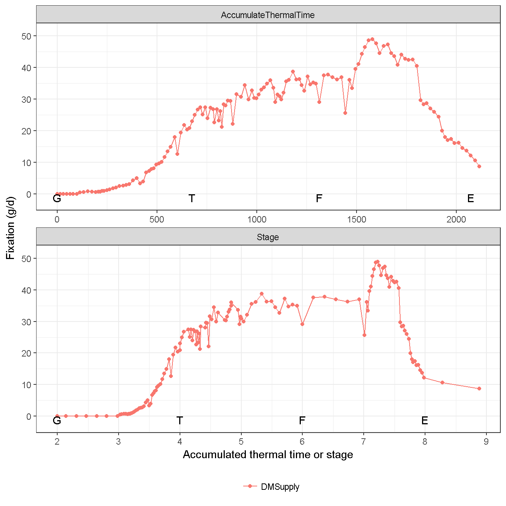
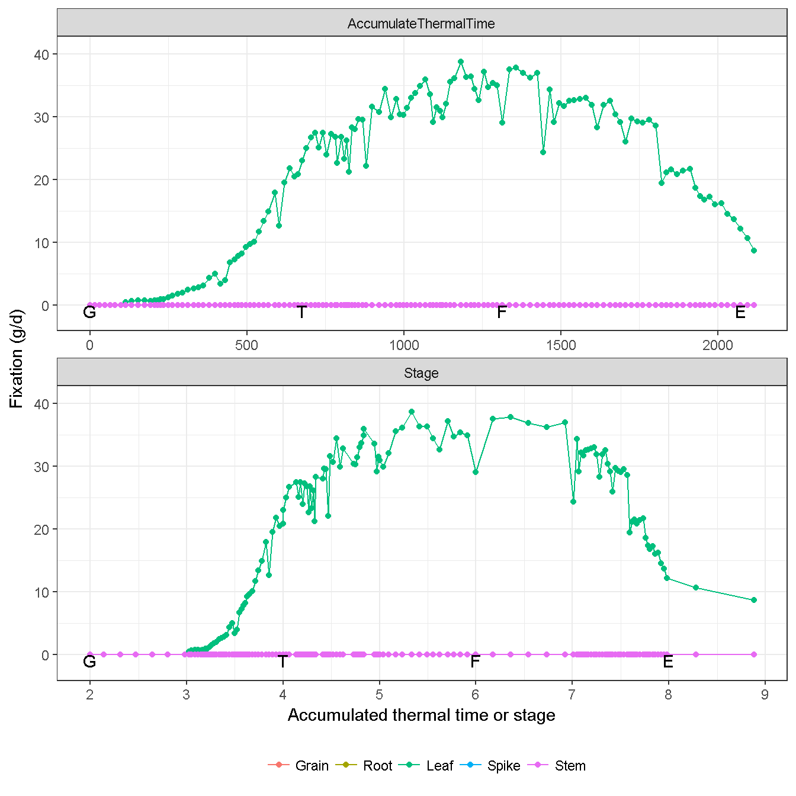
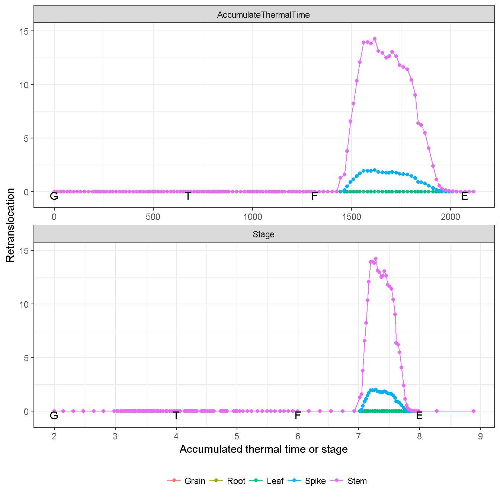
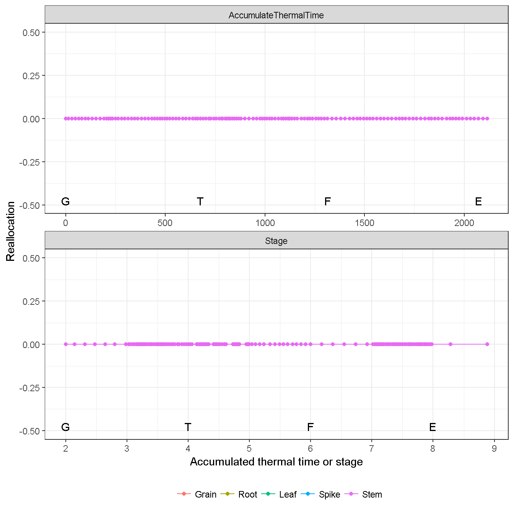
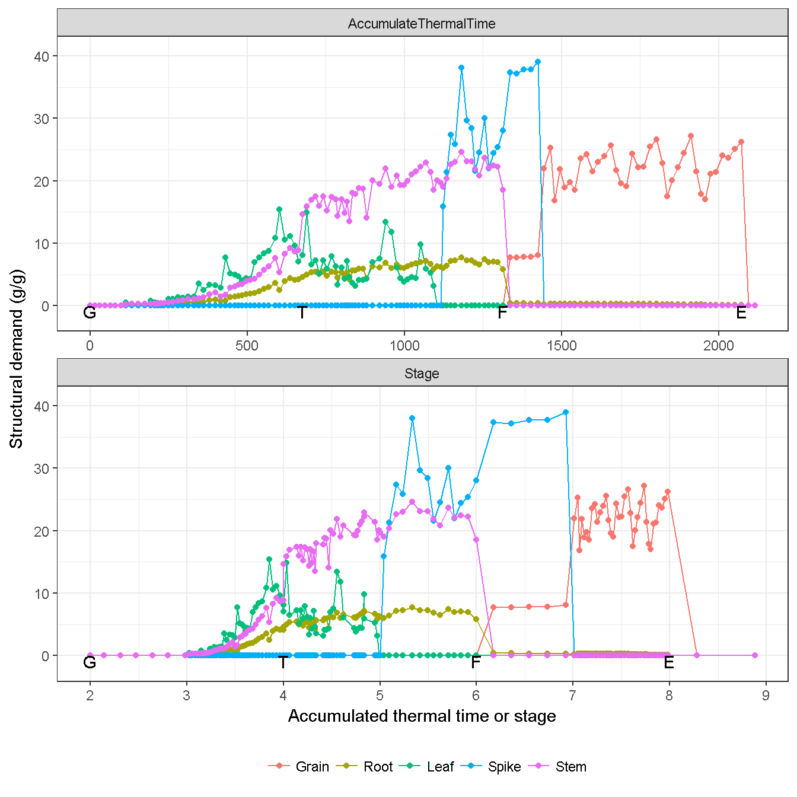
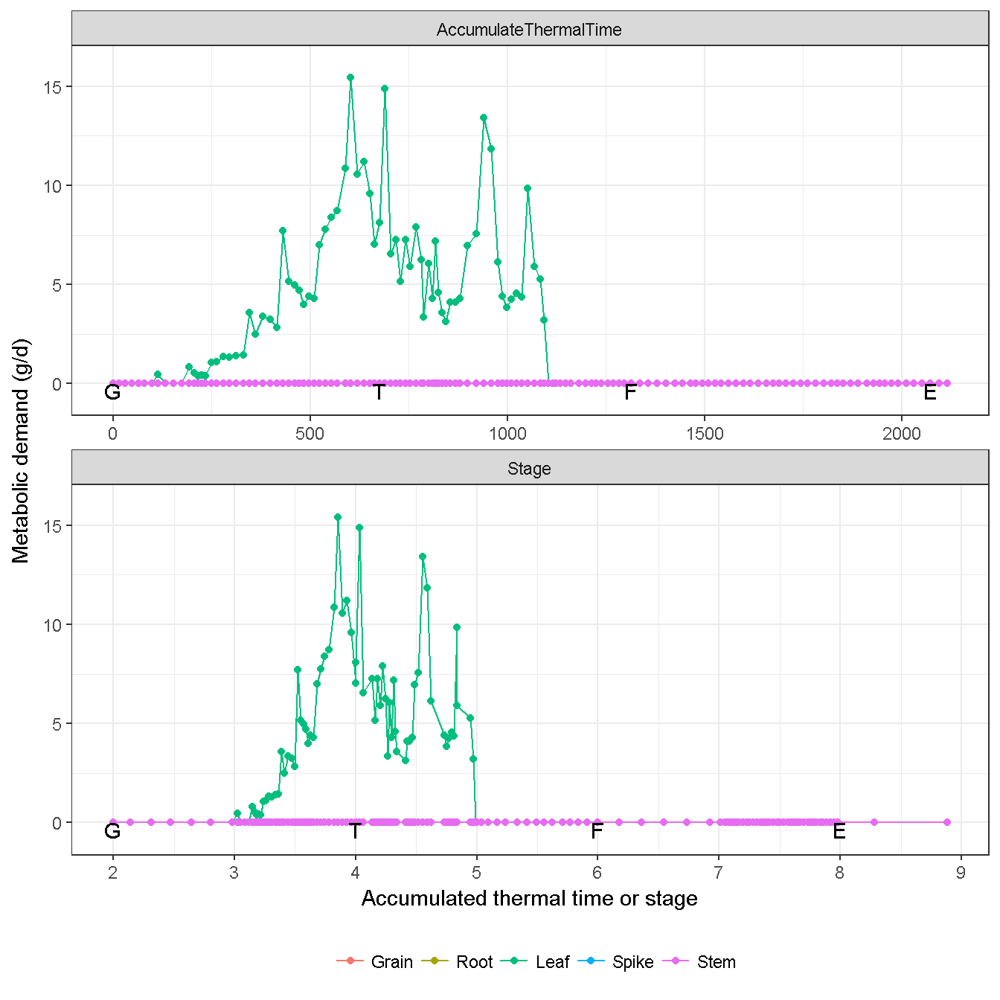
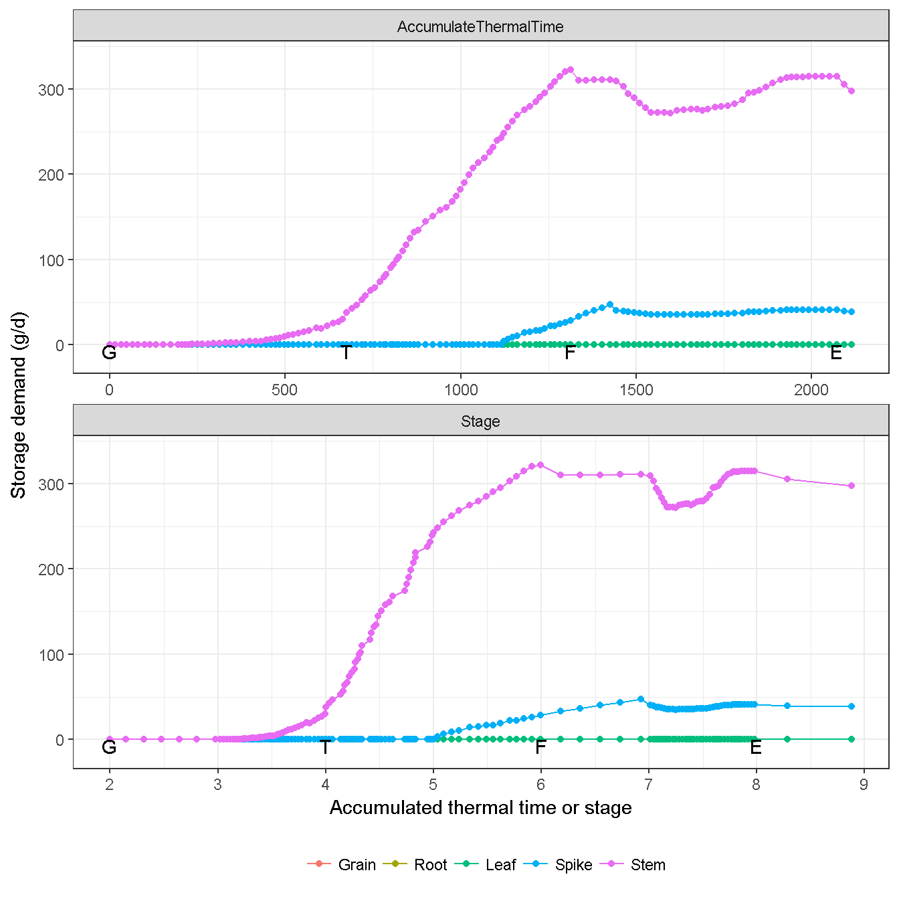
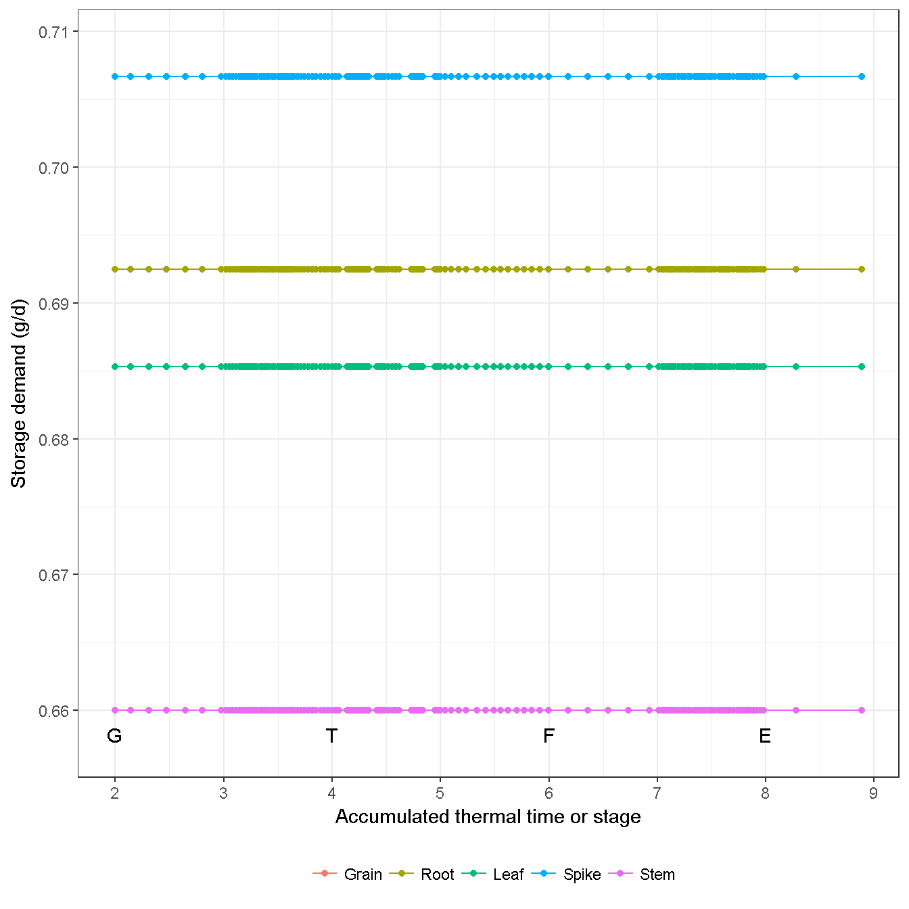

# Biomass {#cha:biomass}

The biomass and nitrogen of each organ is separated into two pools (i.e. `Live` and `Dead`). Each pool is separated into three components (i.e. `Structural`, `Metabolic`, `Storage`) [@BrownPlantModellingFramework2014].

* **Structural biomass and N** are essential for the growth of the organ. They remain within the organ once it has been allocated and are passed from Live to Dead pools as the organ senesces.
* **Metabolic biomass and N** are essential for growth and their concentration can influence the function of organs (e.g. photosynthetic efficiency of the leaf depends on Metabolic nitrogen content). Metabolic biomass and nitrogen may be reallocated (moved to another organ upon senescence of this organ) or retranslocated
(moved to another organ at any time when supplies do not meet the structural and metabolic biomass demands of growing organs).
* **Storage biomass and N** are non-essential to the function of an organ. They will be allocated to an organ only when all other organs have received their Structural and Metabolic allocations and may be reallocated or retranslocated.

## Pool {#sec:biomass-pool}
All organs have the `Live` group, but only `Leaf` has the `Dead` group.

Table: (\#tab:biomass-live-dead)The live and dead groups of biomass () in all organs. X and - indicate the organ has and has not the group, respectively.

 Organ    Live    Dead 
-------  ------  ------
 Grain     X       -   
 Root      X       -   
 Leaf      X       X   
 Spike     X       -   
 Stem      X       -   

## Supply {#sec:biomass-supply}

Biomass supplies are divied into three sources, i.e fixation (i.e. photosynthesis), retanslocation, reallocation (Table \@ref(tab:biomass-supply-type)). The only source of fixation is organ `Leaf`. The sources of retanslocation include organs `Spike` and `Stem`. No reallocation is considered in the wheat model. See details in the organs about the dynamic of biomass supply. 

Table: (\#tab:biomass-supply-type)The source of biomass supply in all organs. X and - indicate the organ has and has not the source, respectively.

 Organ    Fixation    Retranslocation    Reallocation 
-------  ----------  -----------------  --------------
 Grain       -               -                -       
 Root        -               -                -       
 Leaf        X               -                -       
 Spike       -               X                -       
 Stem        -               X                -       

(\#fig:biomass-supply-total)Biomass total supply from all organs

(\#fig:biomass-supply-fixation)Biomass fixation from all organs

(\#fig:biomass-supply-retranslocation)Biomass retranslocation from all organs

(\#fig:biomass-supply-reallocation)Biomass reallocation from all organs

## Demand {#sec:biomass-demand}

Depending on the organ, not all components are considered (Table \@ref(tab:biomass-component-type)). `Structural` component is considered in all organs. `Metabolic` component is only considerred in `Leaf` (Chapter \@ref(cha:leaf)). `Storage` component is only considered in `Stem` (Chapter \@ref(cha:stem)) and `Spike` (Chapter \@ref(cha:spike)).

Table: (\#tab:biomass-component-type)The three components of biomass in all organs. X and - indicate the organ has and has not the component, respectively.

 Organ    Structural    Metabolic    Storage 
-------  ------------  -----------  ---------
 Grain        X             -           -    
 Root         X             -           -    
 Leaf         X             X           -    
 Spike        X             -           X    
 Stem         X             -           X    

`Stem` and `Root` demands determine as the fraction of daily `Fixation` (Fig. \@ref(fig:stem-demand-fraction), and \@ref(fig:root-demand-fraction)). The `Spike` demand determines as the head number and growth duration (Fig. \@ref(fig:spike-demand)).

(\#fig:biomass-demand-structural)Biomass structural demand from all organs

(\#fig:biomass-demand-metabolic)Biomass metabolic demand from all organs

(\#fig:biomass-demand-storage)Biomass storage demand from all organs

## Conversion efficiency (Growth respiration) {#sec-conversion-efficiency}

The allocated biomass of an organ is lost through growth respiration (i.e, 1 - Conversion efficiency). The growth respiration is applied to all components of an organ (i.e. structural, metabolic, storage).

(\#fig:biomass-conversion-efficiency)Biomass conversion efficiency from all organs

