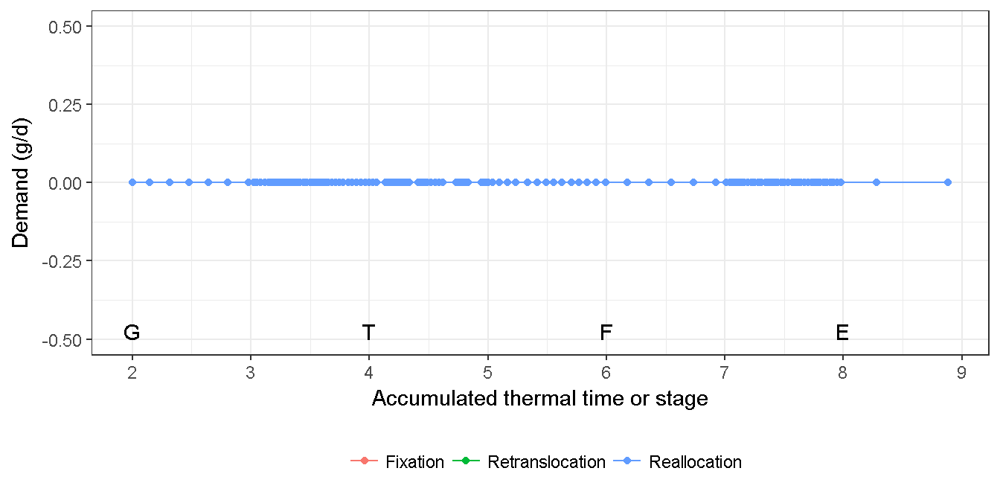
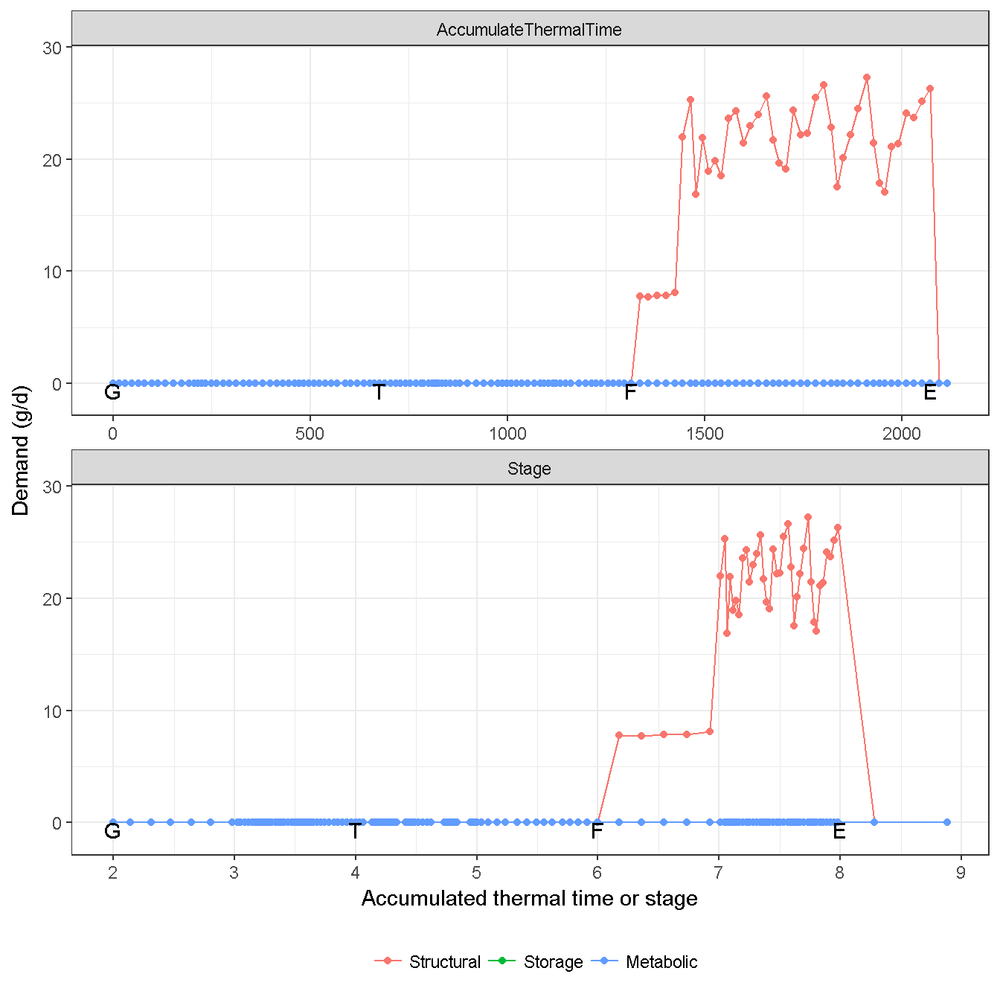
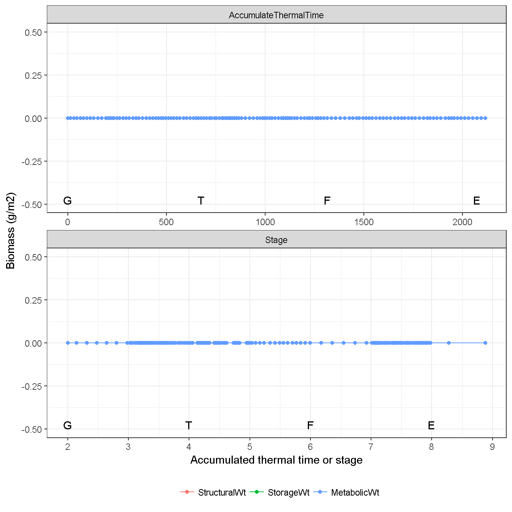
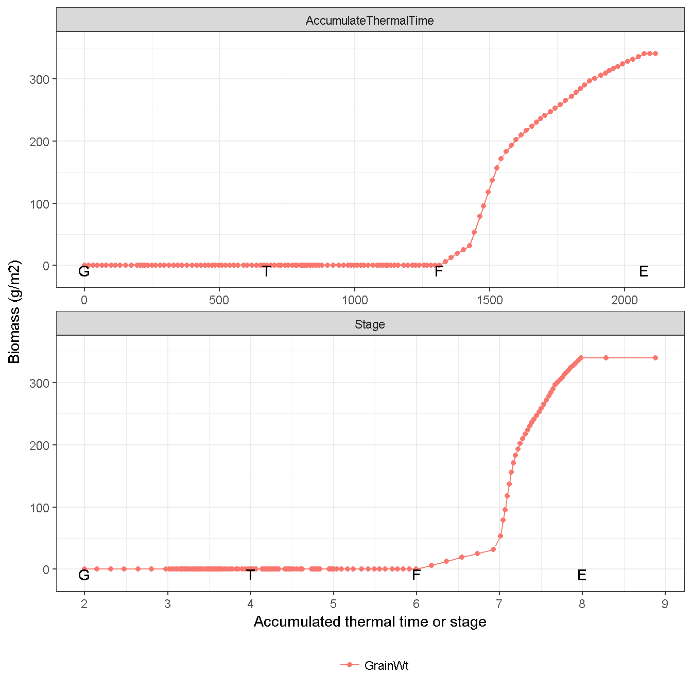
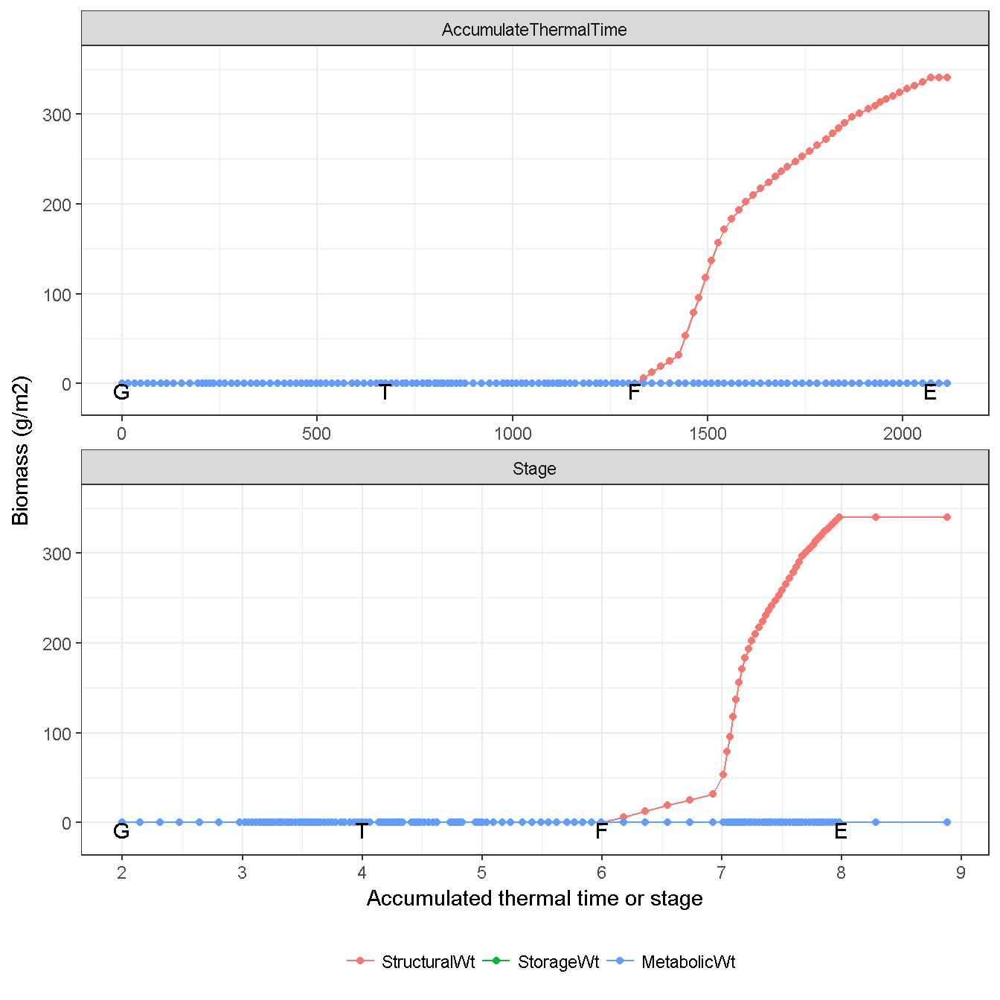

# Grain {#cha:grain}

## Grain number {#sec:grain-number}

The number of grains per plant ($N_{g}$) is determined by the `Stem` and `Spike` total biomass at `Flowering` (including `Live` and `Dead`).
$$
N_{g}=R_{g}(W_{stem} + W_{spike})
$$
where $W_{stem}$ and $W_{spike}$ are the stem and spkie total biomass at flowering, respectively. R_{g} is the grain number per gram stem and spike, with default value at 22 grain g-1.

## Supply {#sec:grain-supply}

No biomass supply is considered in the `Grain` organ (Fig. \@ref(fig:grain-supply)).

(\#fig:grain-supply)Biomass supply from grain

## Demand {#sec:grain-demand}
The grain demand is seperated into two periods (i.e. from `Flowering` to `StartGrainFill` and from `StartGrainFill` to `EndGrainFill`). 

(\#fig:grain-demand)Biomass demand by grain

## Biomass dynamic {#sec:grain-dynamic}

`Grain` only considers the `Live` conponent, No `Dead` component.

(\#fig:grain-allocated)Actual allocated biomass for grain

(\#fig:grain-weight)Dynamic of grain biomass (Total)

(\#fig:grain-live)Dynamic of grain biomass (Live component)

(\#fig:grain-dead)Dynamic of grain biomass (Dead component)

