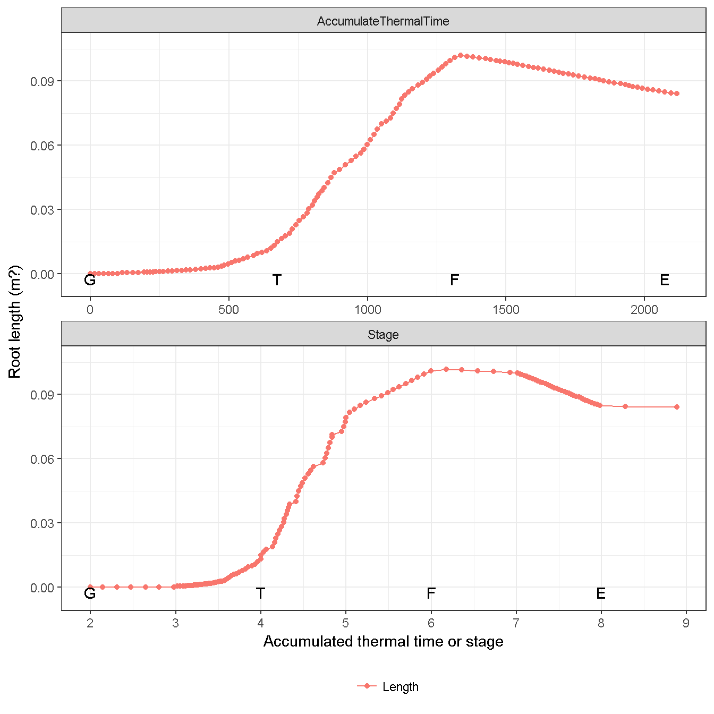
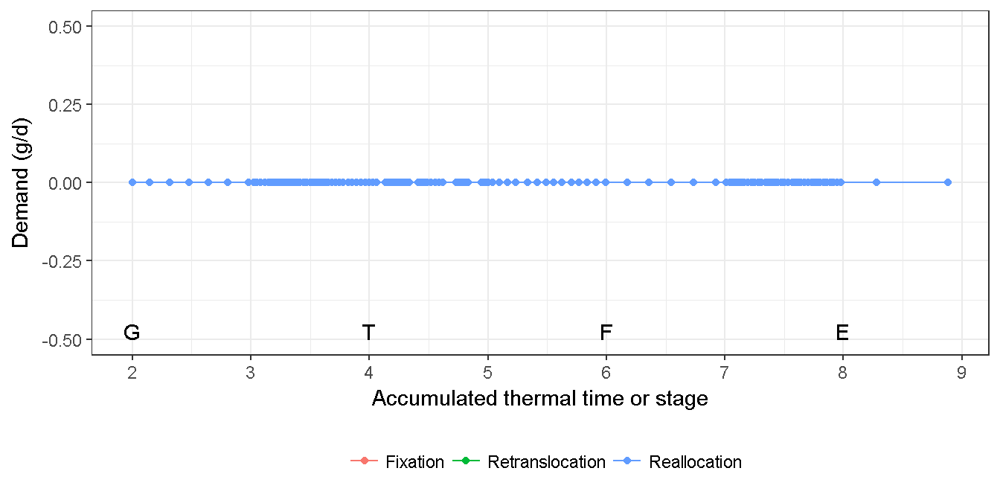
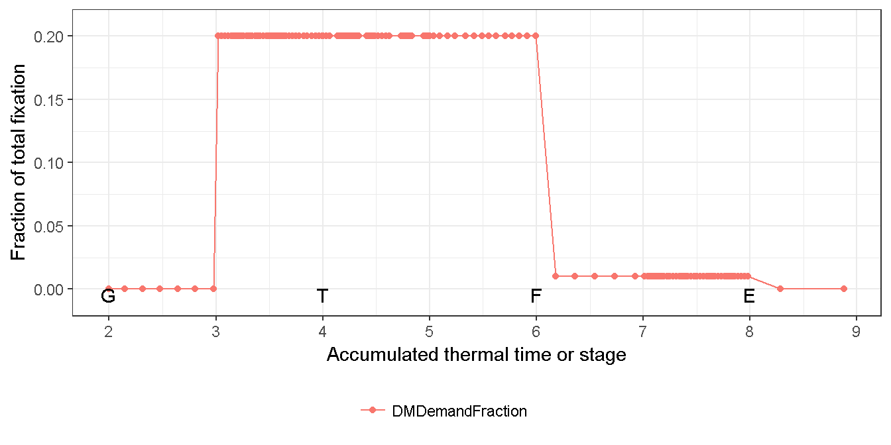
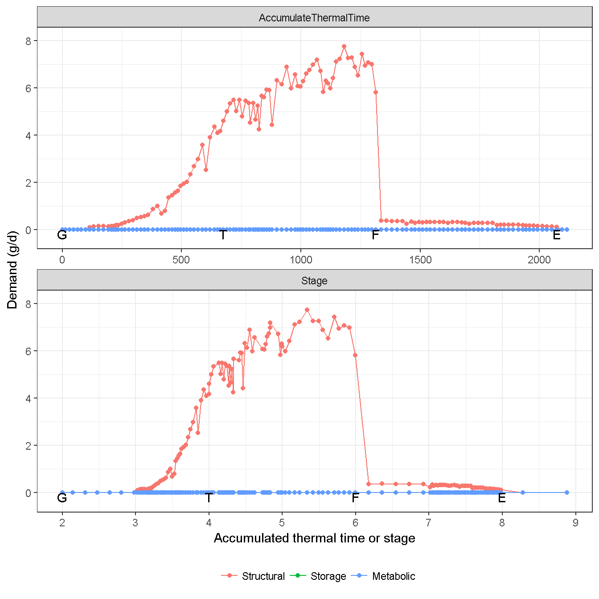
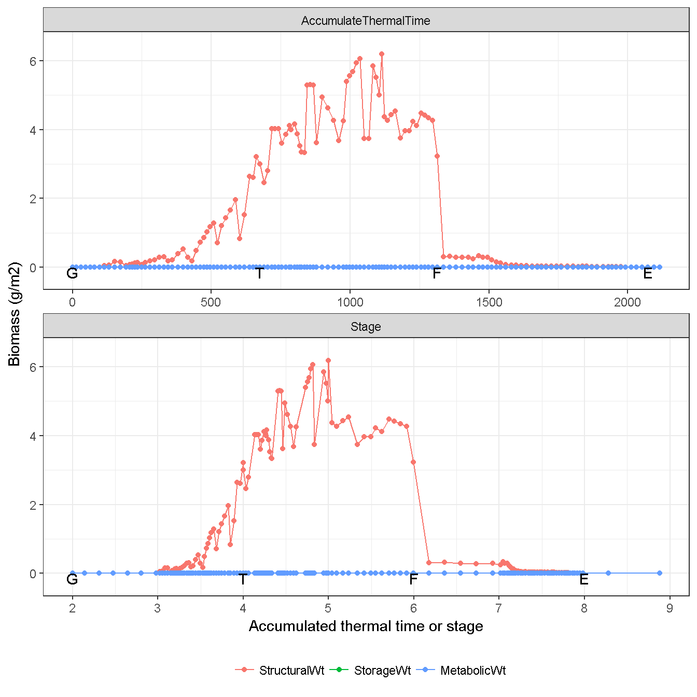
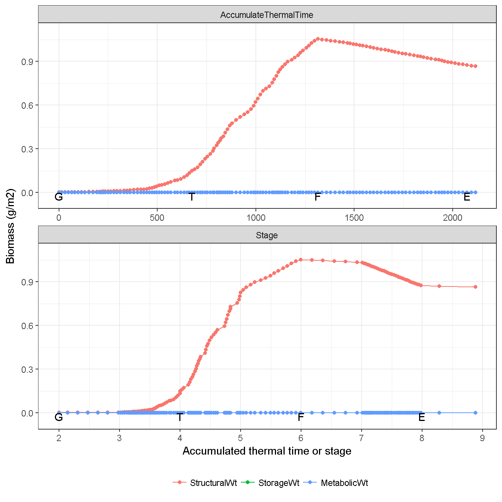
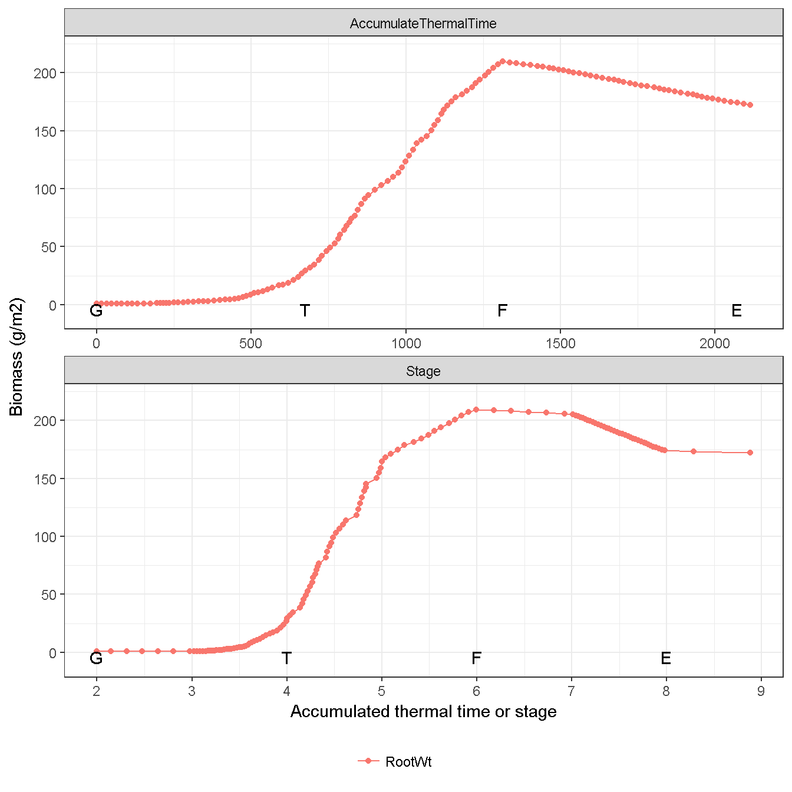
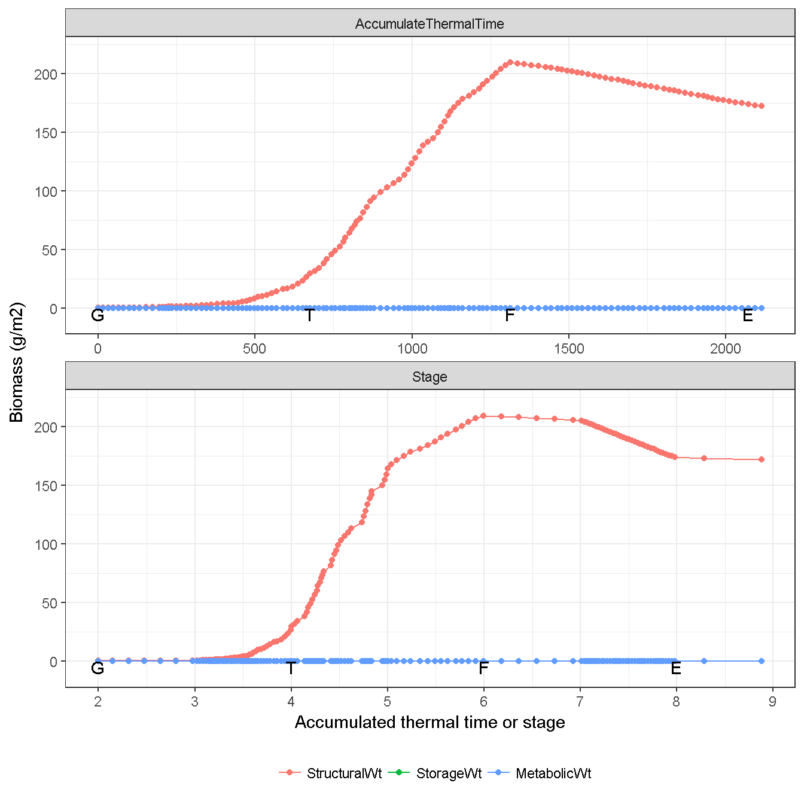

# Root {#cha:root}

Only `Structural` is considered in the three components of biomass for `Root`. The biomass allocation depending on the fraction of daily fixation (i.e. photosynthesis).

## Root length {#sec:root-length}

(\#fig:root-length)Root length

## Supply {#sec:root-supply}

No biomass supply is considered in the `Root` organ (Fig. \@ref(fig:root-supply)).

(\#fig:root-supply)Biomass supply from root

## Demand {#sec:root-demand}

The daily biomass demand of `Root` is calculated as a fraction of daily fixation (i.e. photosynthesis) from Stage 3 (`Emergence`) to Stage 8 (`End of grain filling`). The fraction of root demand is 0.2 until `Flowering time`, then reduces into 0.02 until `End of grain filling` (Fig. \@ref(fig:root-demand-fraction)). Only structural demand is considered in the `Root` organ (Fig. \@ref(fig:root-demand)). 

Photosynthate is not partitioned into root after heading [@Fangsituassessmentnew2016].

(\#fig:root-demand-fraction)Fraction of root demand in the total fixation 

(\#fig:root-demand)Biomass demand by root

## Biomass dynamic {#sec:root-biomass}

The actual allocation (Fig. \@ref(fig:root-allocated)) is determined by the actual daily biomass supply (Fig. \@ref(fig:biomass-supply-total)) which may be smaller than than biomass demand (Fig. \@ref(fig:root-demand)). 

(\#fig:root-allocated)Actual allocated biomass for root

The daily loss of roots is calculated using a SenescenceRate function (0.005 in the default value).  All senesced material is automatically detached and added to the soil fresh organic matter (FOM) pool.  

(\#fig:root-detached)Detached biomass from root into soil organic.

Finally `Root` biomass increases until `flowering time`, then gradually decreases as the senescence is more than allocation (Fig. \@ref(fig:root-weight)). All biomass is allocated into `Live` component (Fig. \@ref(fig:root-live)), as the senescenced `Root` immediately is detached and contributed into soil FOM (Fig. \@ref(fig:root-dead)).

(\#fig:root-weight)Dynamic of root biomass (Total)

(\#fig:root-live)Dynamic of root biomass (Live component)

(\#fig:root-dead)Dynamic of root biomass (Dead component)

