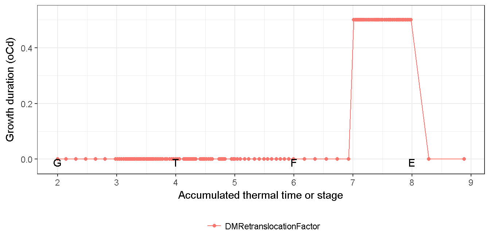
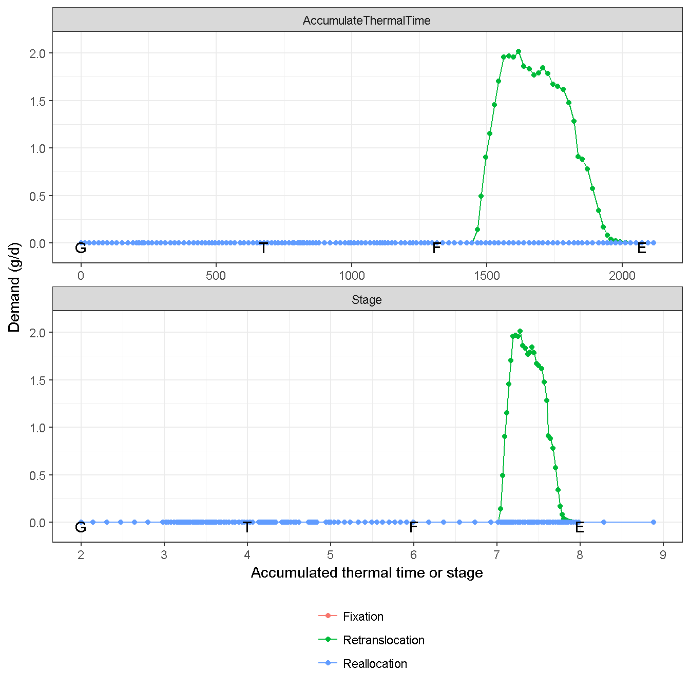
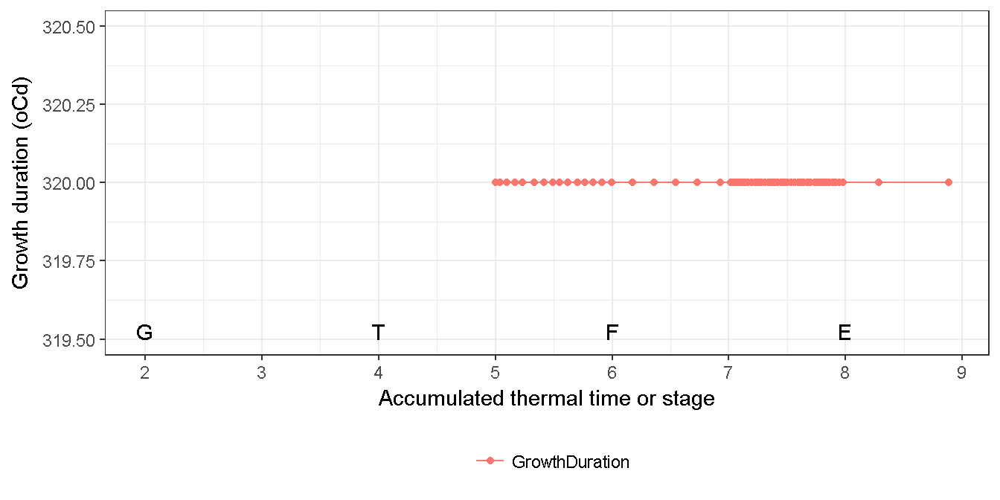
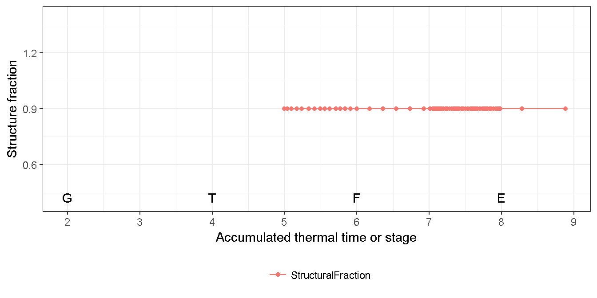
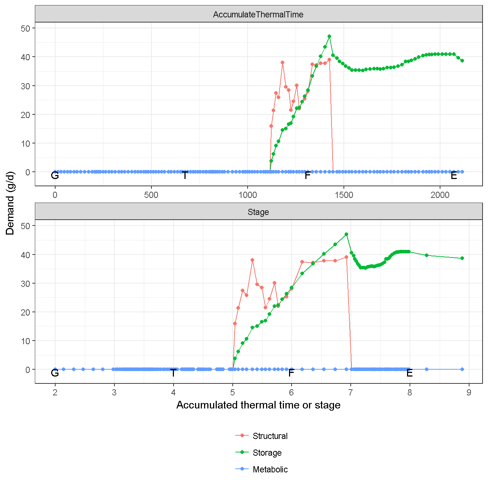
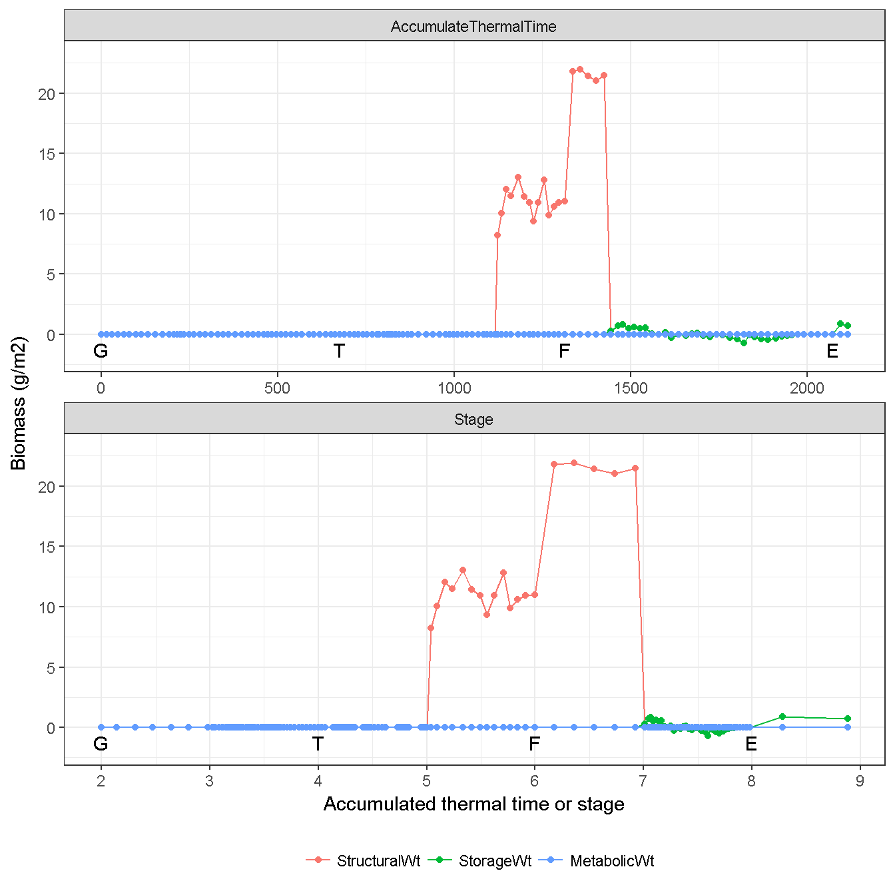
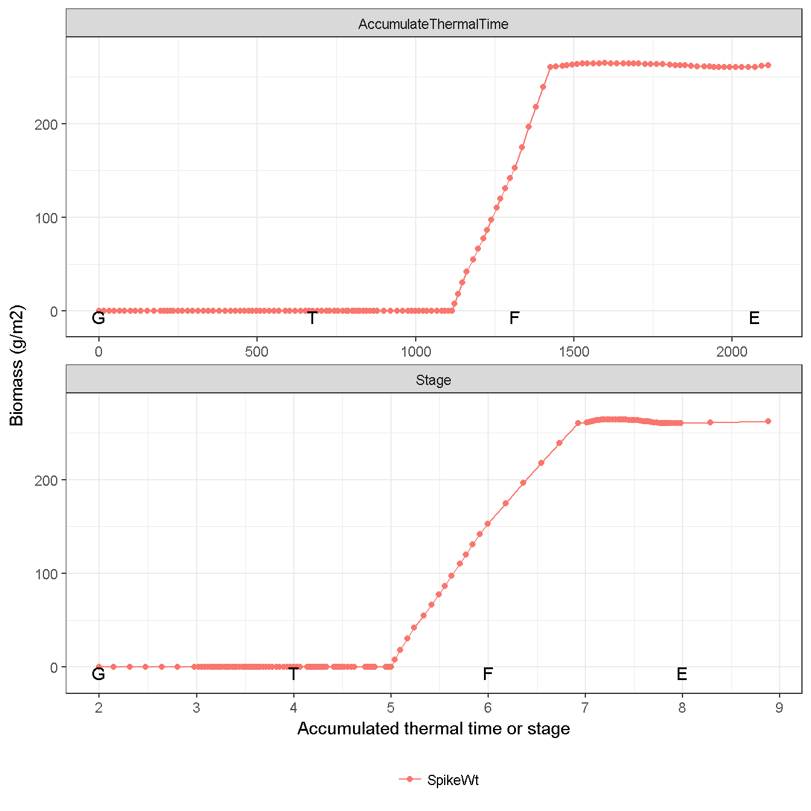
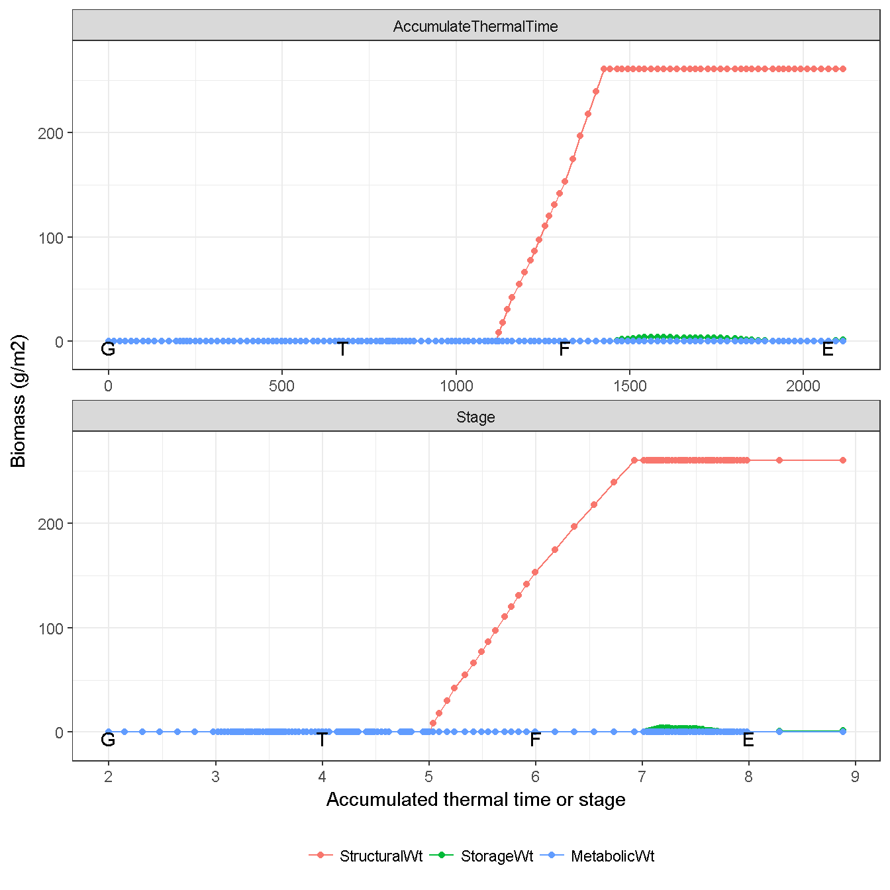
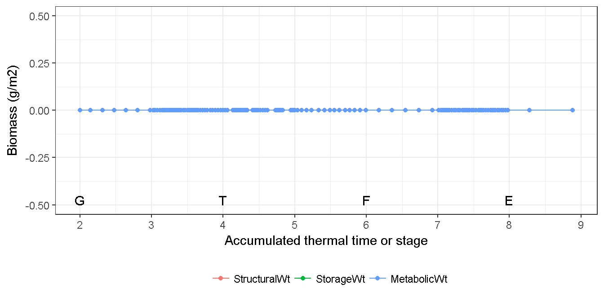

# Spike {#cha:spike}

`Spike` provides biomass through retranslocation, requires biomass depending on the population and potential spike weight. The biomass is allocated into two components, i..e `Structural` and `Storage`. No `Metabolic` is considered.

## Supply {#sec:spike-supply}

In `Spike`, the biomass supply only sources from retranslocation (Fig. \@ref(fig:spike-supply)). Daily retranslocation is the proportion of current storage ($W_{spike, storage}$). The default value of proportion is 0.5 since `StartGrainFill`, i.e. retranslocatable biomsss is 50% during grain filling (Fig. \@ref(fig:spike-retran-factor)).

(\#fig:spike-retran-factor)Growth duration of spike development

 

(\#fig:spike-supply)Biomass supply from spike

## Demand {#spike-demand}

The Structural demand of `Spike` ($D_{spike, structural}$) is determined by the population based demand function since Stage 5 (`FlagLeaf`) to Stage 7 (`StartGrainFill`). The structural demand includes the growth respiration. 

$$
D_{spike, structural} = \Delta TT \times N_{head} \frac {W_{max, grain}}{T_{growth}} \times F_{spike, structure} / C_{spike, efficiency}
$$
where $\Delta TT$ is the daily thermal time in the phenology module (Fig. \@ref(fig:phenology-tt)); $N_{head}$ is the head number per unit area, i.e. stem population (Fig. \@ref(fig:str-plant-population)); $W_{max, grain}$ is the potential weight per spike (g) with default value 0.5; $T_{growth}$ is the growth duration of spike ($TT$, the thermal time target from `FlagLeaf` to `StartGrainFill`). As the target of `EarlyReproductive` is sensitive to photoperiod (Section \@ref(sec:phe-stage-period)), the growth duration can be changed during spike development depending on the photoperiod (Fig. \@ref(fig:spike-growth-duration)). The head number, growth duration and potential spike weight are defined as potential spike weight including the structural and storage conponents and the growth respiration. 

$F_{spike, structure}$ is the structura fraction of `Spike` with default value 0.9 (Fig. \@ref(fig:spike-stucture-fraction)). $C_{spike,efficiency}$ is the conversion efficiency of `Spike`, i.e. the efficiency of alloction biomass converted into structural carbon (growth respiration). $C_{efficiency}$ has the default value 0.7067 (Fig. \@(fig:spike-stucture-fraction)). 

(\#fig:spike-growth-duration)Growth duration of spike development

(\#fig:spike-stucture-fraction)Growth duration of spike development

(\#fig:spike-conversion-efficiency)Conversion efficiency of spike

Storage demand is to fill the non-structural components (i.e. storage for `Spike`). Current structural biomass and structural demand are used to calculate the potential total biomass of `Spike` (structural plus storage). The difference of potental total biomas and current biomass are the storage demand. Storage demand also include the growth respiration.    

$$
D_{spike, storage} = \frac {(W_{spike, structural} + D_{spike, structural}) / F_{spike, structure} - W_{spike, structural} + W_{spike, storage} + D_{spike, structural}} {C_{spike, efficiency}}
$$

No metabolic demand is calculated for `Spike`. 

The figure below shows the demands of `Spike` in the test simulation (Fig. \@(fig:spike-demand)).

(\#fig:spike-demand)Biomass demand by spike

## Biomass dynamic {#spike-biomass}

The actual allocation reflects the increase of structural component, and retranslocation of storage component (Fig. \@ref(fig:spike-allocated)). `Spike` only considers the `Live` biomass (Fig. \@ref(fig:spike-live), no `Dead` biomass (Fig. \@ref(fig:spike-dead)).

(\#fig:spike-allocated)Actual allocated biomass for spike

(\#fig:spike-weight)Dynamic of spike biomass (Total)

(\#fig:spike-live)Dynamic of spike biomass (Live component)

(\#fig:spike-dead)Dynamic of spike biomass (Dead component)

