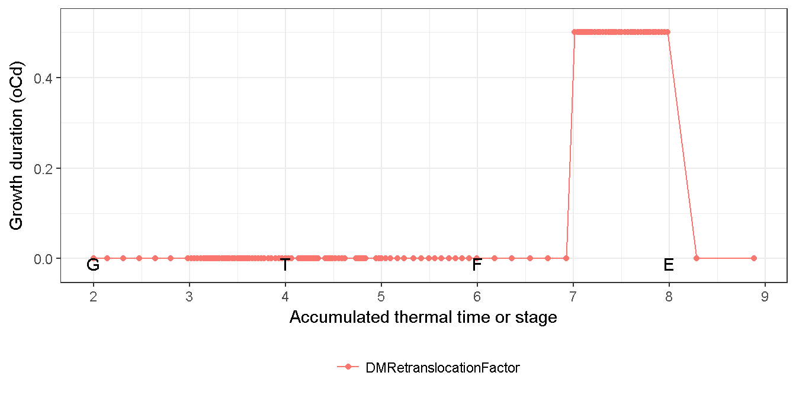
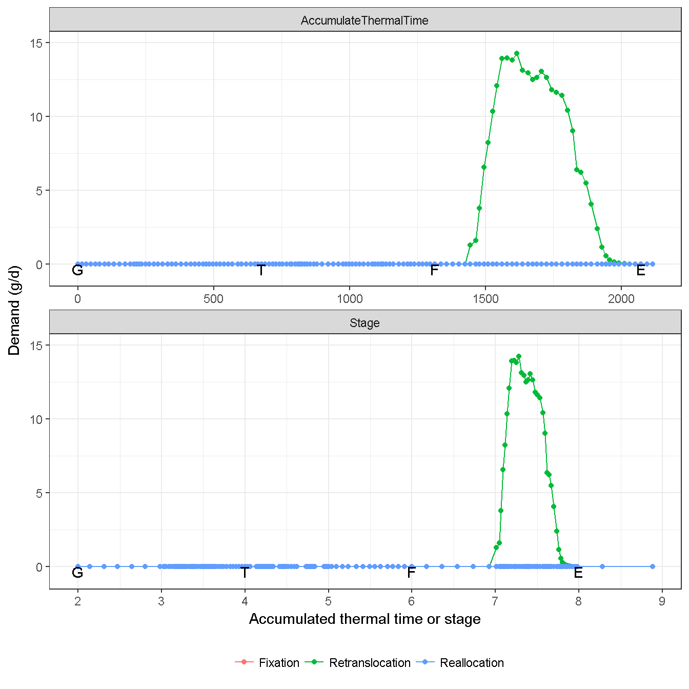
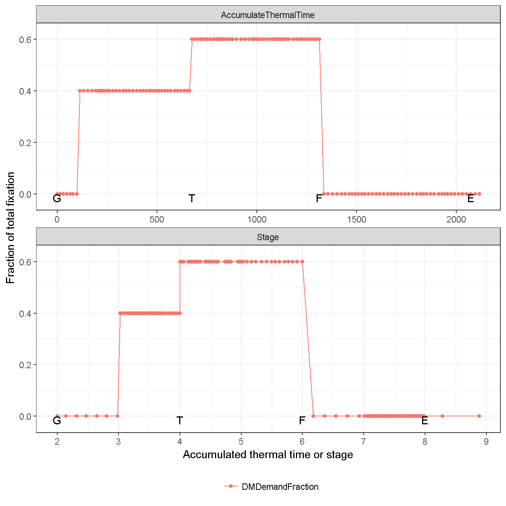
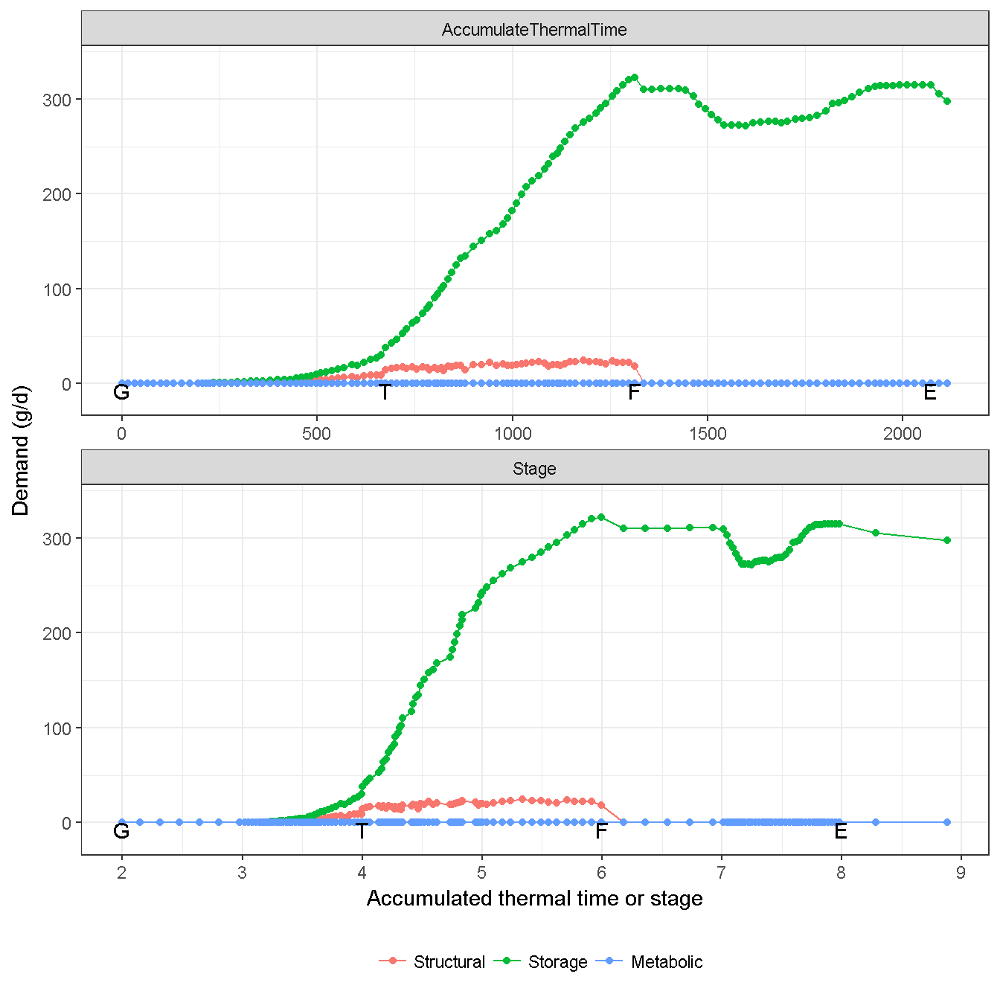
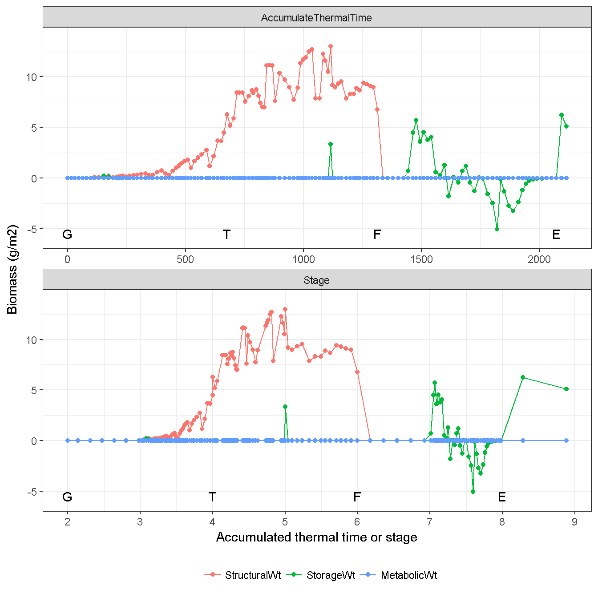
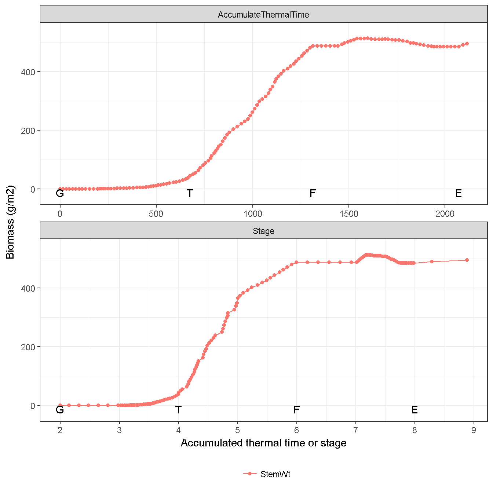
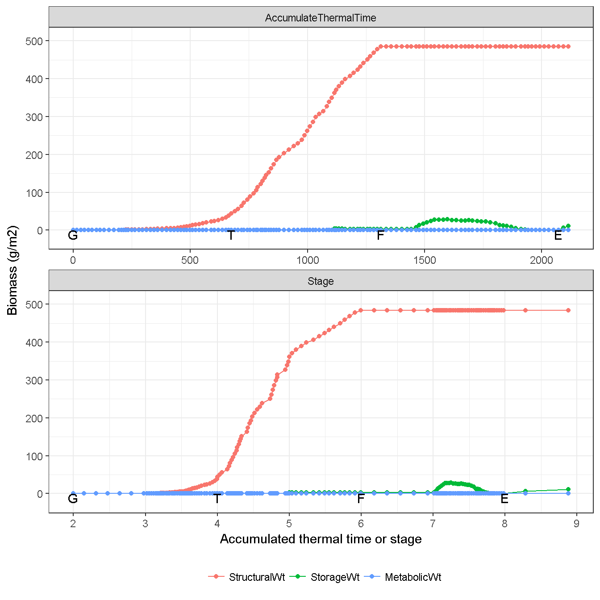

# Stem {#cha:stem}

`Stem` provides biomass through retranslocation, requires biomass a proportion of daily fixation (i.e. photosynthesis in `Leaf`). The biomass is allocated into two components, i..e `Structural` and `Storage`. No `Metabolic` is considered.

## Supply {#sec:stem-supply}

In `Stem`, the biomass supply only sources from retranslocation (Fig. \@ref(fig:stem-supply)). Daily retranslocation is the proportion of current storage ($W_{stem, storage}$). The default value of proportion is 0.5 since `StartGrainFill`, i.e. retranslocatable biomsss is 50% during grain filling (Fig. \@ref(fig:stem-retran-factor)).

(\#fig:stem-retran-factor)Growth duration of stem development

(\#fig:stem-supply)Biomass supply from stem

## Demand {#sec:stem-demand}

The daily biomass demand of `Stem` is calculated as a fraction of daily fixation (i.e. photosynthesis) from Stage 3 (`Emergence`) to Stage 6 (`Flowering time`) (Fig. \@ref(fig:stem-demand-fraction)) and increases at Stage 4 (`Terminal spikelet`) (Fig. \@ref(fig:stem-demand-fraction)). After `Flowering time`, no biomass allocated into stem (Fig. \@ref(fig:stem-demand)).  

(\#fig:stem-demand-fraction)Fraction of stem demand in the total fixation 

(\#fig:stem-demand)Biomass demand by stem

## Biomass dynamic {#sec:stem-biomass}

The actual allocation reflects the increase of structural component, and retranslocation of storage component (Fig. \@ref(fig:stem-allocated)). `Stem` only considers the `Live` biomass (Fig. \@ref(fig:stem-live), no `Dead` biomass (Fig. \@ref(fig:stem-dead)).

(\#fig:stem-allocated)Actual allocated biomass for stem

(\#fig:stem-weight)Dynamic of stem biomass (Total)

(\#fig:stem-live)Dynamic of stem biomass (Live component)

(\#fig:stem-dead)Dynamic of stem biomass (Dead component)

