# Structure {#cha-structure}

The development of wheat leaves and tillers are simulated with an apex model which is further developed from leaf cohort model [@BrownPlantModellingFramework2014]. The basic assumptions include

1. The growth and development of a plant is controlled by apex. Only one apex is existed in a plant at emergence. Branching increases the total apex number of a plant. Apex death decreases the apex number, which are caused by several reasons including the carbon allocation, light intensity, natural death. The apex number is not necessary as an integer to simulate plant development in the population level. 
2.	The number of apex in a plant determines the number of the new leaves when initialization of a new cohort. The cohort size is fixed after initialization although attributes can be changed in the later stage. 
3.	The apexes are grouped by age and have the same age if they initialize at the same day. During development of new cohort, new apexes caused by branching develops into new tillers which have the same behaviours during the whole lift span (e.g. size, area, nitrogen, photosynthesis). The apex age equals to 1 when it initialize and increases by 1 when a new leaf cohort initializes. Each apex group has several attributes including size and age.  
4.	The leaves in a cohort also are distinguished and grouped by apex ages, which determines at the initialization of leaf cohort. 
5.	Death of branches or tillers only reduces the total number of apexes, not the size of existing cohorts. The apexes with youngest age are going to death first. 

## Phyllochron {#sec:str-phyllochron}

The phyllochron is the intervening period between the sequential emergence of leaf tips on the main stem of a wheat [@mcmaster_re-examining_2003].

The non-linear reponse of temperature on phyllchron were observed by Friend et al. [-@friend_leaf_1962]  and Cao and Moss [-@cao_temperature_1989]. The soil temperature provided more accurately prediction of leaf development than air temperature [@JamiesonPredictionleafappearance1995]. However, a simple linear reponse of phyllochron to air temperature works surprusingly well in predicting phyllochron for most field conditions [@mcmaster_re-examining_2003]. If improvements are desired, the use of non-linear reponses and soil temperature shows promise [@JamiesonPredictionleafappearance1995; @YanEquationModellingTemperature1999]. Consequently, we assume the linear reponse of air temperature on leaf appearance (phyllochorn).  

The base phyllochron is a genotypic parameter with default value 120, but is chagned by most of cultivars. Based on [@JamiesonPredictionleafappearance1995], leaf appearance could be described by a base phyllochron determined between leaves 3 and 7 and a phyllochron that was 70% of base phyllochron for leaves < 3 and 140% of base phyllochroen for leaves > 7 (Fig. \@ref(fig:str-phyllochron-age)). The phyllochron also is adjusted by photoperiod [reference required] through increasing pholochron in the shorter day length (Fig. \@ref(fig:str-phyllochron-ppd)).

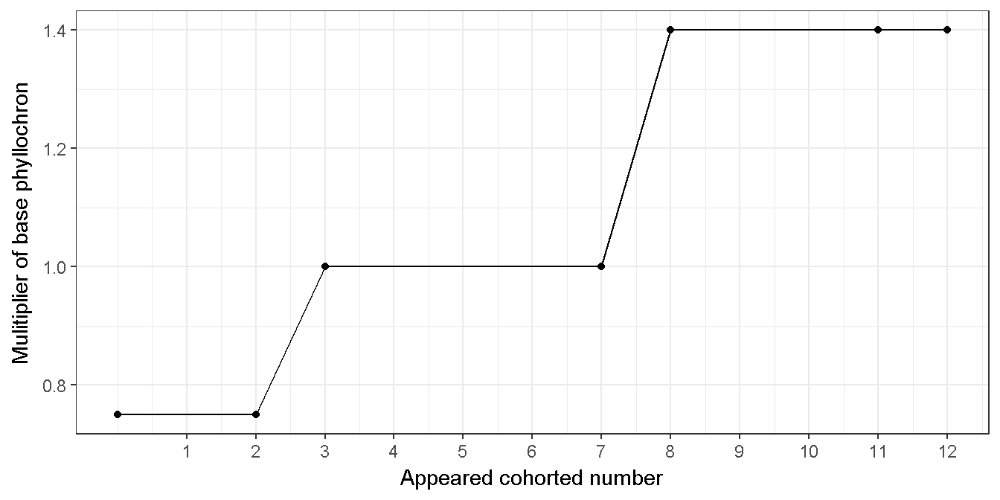

(\#fig:str-phyllochron-age)Phyllochron of leaf cohort is depending on the rank on the main stem

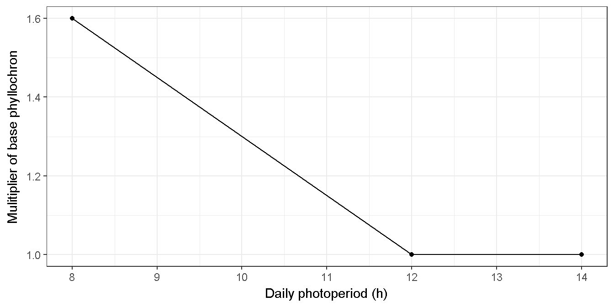

(\#fig:str-phyllochron-ppd)The multiplier of phyllochron which is effected by daily photoperiod length.

Finally, the phyllochron is dynamically adjusted according to appeared cohort number and daily photoperiod (Fig. \@ref(fig:str-phyllochron)). 

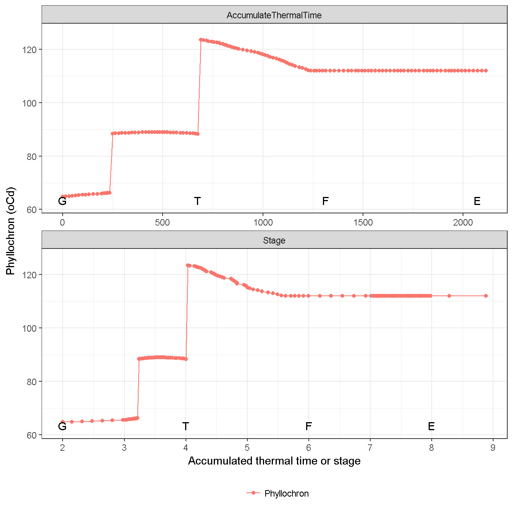

(\#fig:str-phyllochron)The actual phyllochron in the testing environment

<!--
## Final leaf number {#sec:final-leaf-number}

Brown et al. [-@BrownIntegrationmolecularphysiological2013] showed final leaf number (FLN) could be estimated as 2.86 + HSTS * 1.1 where HSTS is the the Haun stage at terminal spikelet. To caputre this in the wheat model we have set the initial number of primordia (determined by the number of initialleaf objects on the leaf class) to 3 and have set this function to produce primordia 10% faster than mainstem leaves.  Primordia are initiated until the therminal spikelet stage and then the number remains fixed, giving final leaf number.

The final leaf number in the main stem (FinalLeafNumber, Section \@ref(output-structure)) equal to minimum leaf number, plus the increases of leaf number which are caused by delay of wheat development (vernalization and and photoperiod effects). The minimum leaf number is a genotypic parameter to represent 

[Need to describe the vernalization and photoperiod effects on leaf number].

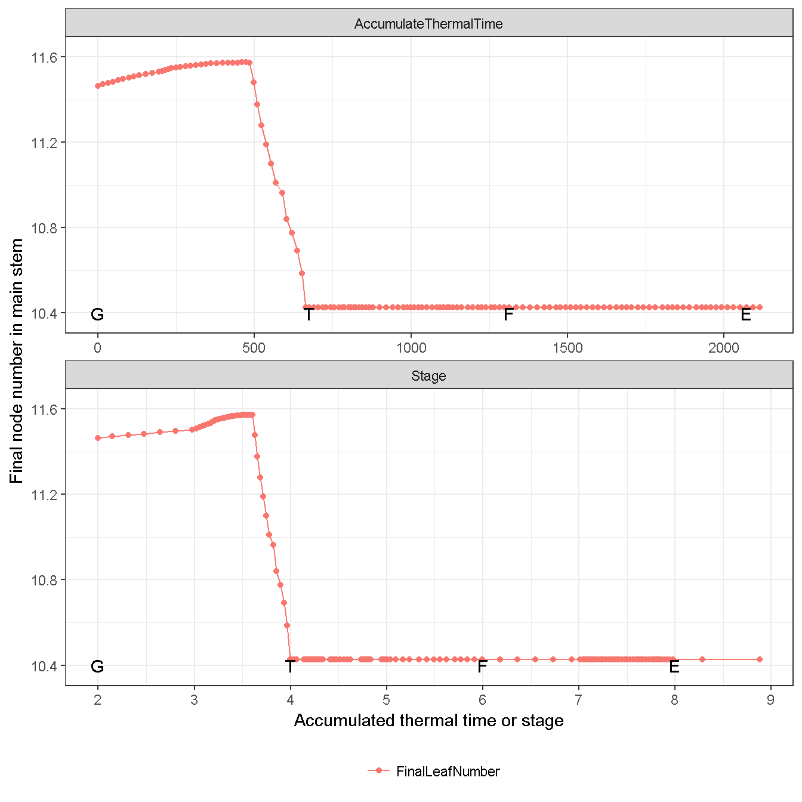

(\#fig:final-leaf-number)Final leaf number in main stem

The final node number is daily updated and gradually decreased as the photoperiod (longer day length) and vernalization (satisfication of vernalization requirement) effects.

Need to check the response of day length and vernalization requirement on leaf number.

--> 

## Initialization and appearance of leaf tips on main stem {#sec:main-stem}

At `Germination` stage, 2 new leaf cohorts or tips are initialized at the main stem. At `Emergence` stage, 1 leaf cohort or tip is appeared at the main stem, and 1 more leaf cohort is initialized. The potential appearance of leaf tip number ($N_{p, tip}$) is initialized as 1. 

After `Emergence`, the potential appearance of tip number in the main stem ($N_{p, tip}$) is daily increased according to the daily phyllochron (Fig. \@ref(fig:str-phyllochron)) and thermal time (Section \@ref(sec:phe-thermal-time)) until `Maturity` (Fig. \@ref(fig:str-delta-tip) and \@ref(fig:str-tips). $N_{p, tip}$ should stop increasing when final leaf number is reached). 

$$
 \Delta N_{p, tip} = \frac{\Delta TT_{t}}{P_{phy}}
$$

where, $N_{p, tip}$ is the daily increase of leaf tip number (Fig. \@ref(fig:str-delta-tip)), $\Delta TT_{t}$ is the daily thermal time, $P_{phy}$ is the phyllochron calculated at today. 

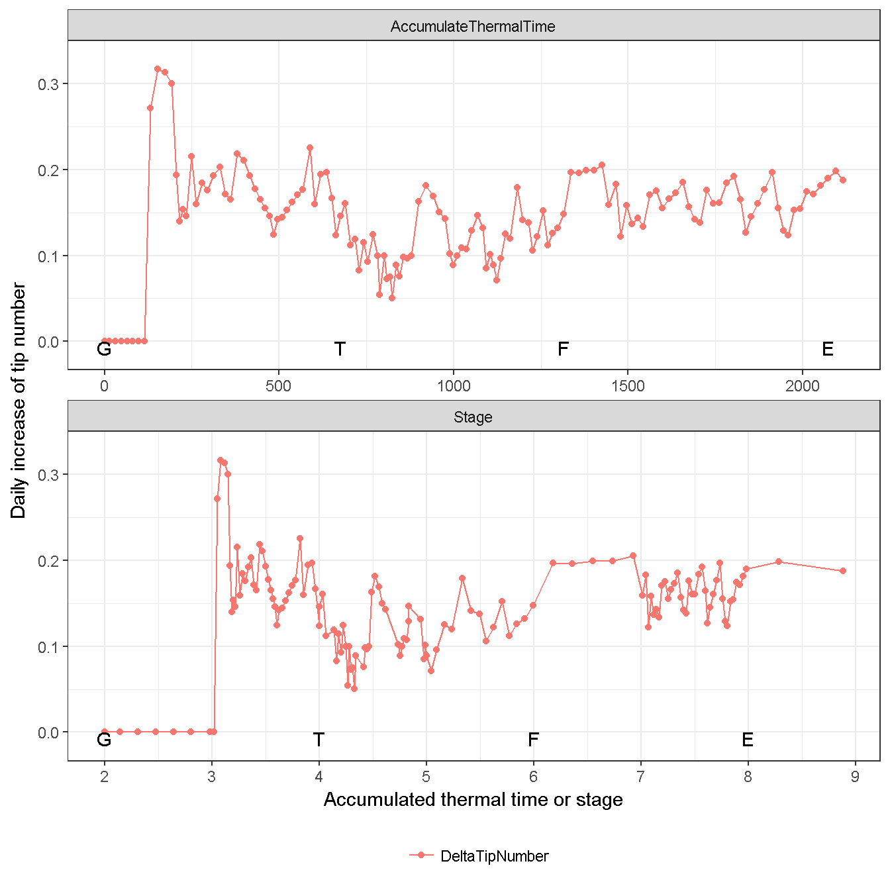

(\#fig:str-delta-tip)Daily increase of tip number in main stem

Potential appearance of tip number in main stem ($N_{p, tip}$) are summarized daily increases since `Emergence`, plus the appeared leaf tip at `Emergence` (1 for wheat model) (Fig. \@ref(fig:str-tips)).

$$
    N_{p, tip}=\sum_{t=T_{0}}^{T}\Delta N_{p, tip} + 1
$$

where, $T_{0}$ is day of `Emergence`.  $T$ is today. In the Structure model, the tip numbers are not calculated for branches or tillers, but only for main stem (Figure \@ref(fig:node-number)). 

Before plant reaches the final leaf number (i.e. all leaves are initialized and appeared), a new leaf cohort is initialized and appeared when increases of $N_{p, tip}$ are more than 1 (Figure \@ref(fig:str-delta-tip)). Consequently, the rates of leaf initialization and appearance are same, except initialized tip number is more than 2  of appeared tip number.

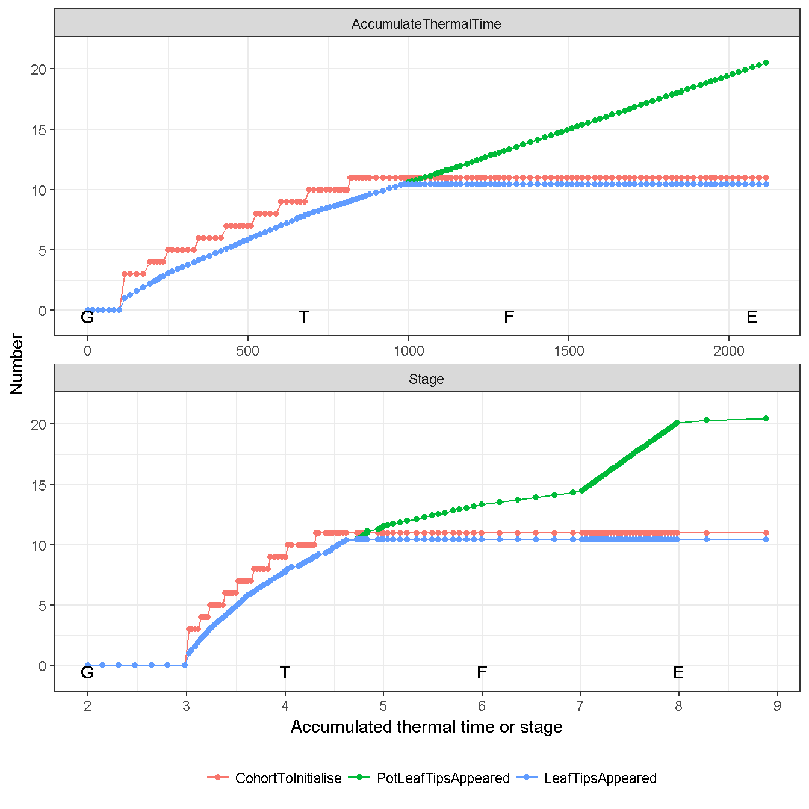

(\#fig:str-tips)Tips number in main stem

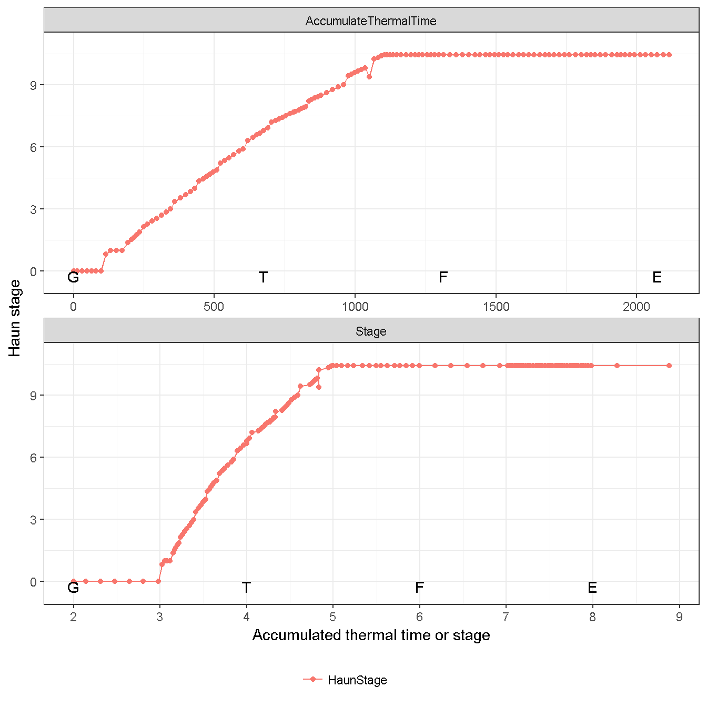

(\#fig:str-haun-stage)Haun stage in main stem

<!-- 

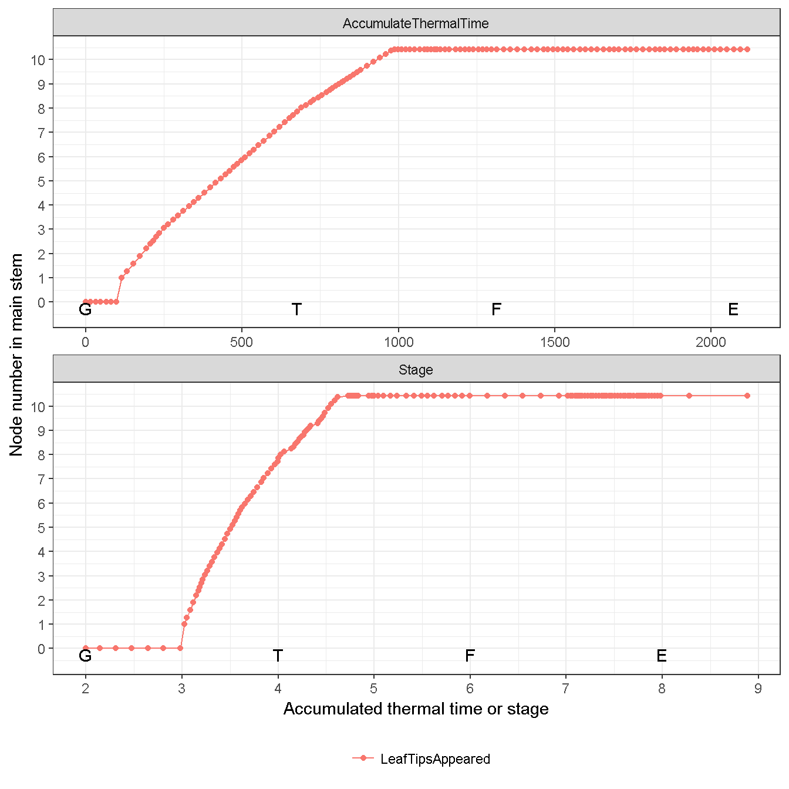

(\#fig:node-number)Primordia and node number in main stem

The node numbers in the main stem are not necessary integar to simulate the variation of primordia number in the actual field. Consequently all attibutes of flag leaf are proportionally reduced (e.g. growth duration and maximum area).

## Tillering

The apex number in a plant ($A$) is increased by branching ($\Delta A_{B} $) and decreased by mortality ($\Delta A_{M} $). New tillers are initialized when increase of the node number in main stem ($\Delta N_{node}$) is more than 1. In the leaf cohort model, tiller number represents by the cohort size (i.e. the number of leaves in a cohort). 

$$
A = \sum_{i=1}^{N_{node}}{(\Delta A_{B} - \Delta A_{M})}
$$

### Branching

The branching rate in a plant is specified by parameter BranchingRate ($\Delta A_{B}$) and is calculated as potential branching rate and several stress factors (i.e. nitrogen stress, total coverage, and water stress). From stage Emergence to Terminal Spikelet (Section \@ref(stage-period)), the potential branching rate is defined as a function of number of appeared cohorts in the main stem (Figure \@ref(fig:str-branching-rate)) which follow the pattern of Fibonacci sequence. Beyond this period, the branching rate is set as zero. 

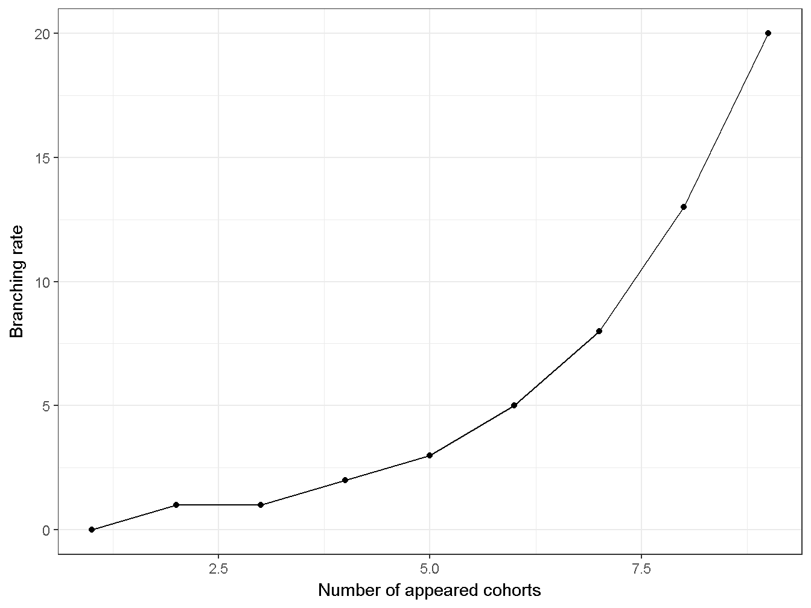

(\#fig:str-branching-rate)Potential branching rate of APSIM-Wheat as a function of appreared cohort number

Two stresses are defined in the APSIM-Wheat including nitrogen and WSC. A simple sensitivity analysis indicates the branching rate is too sensitive to WSC with default values (x = [0.1, 0.2]; y = [0, 1]). So, this feature is disabled for further analysis. 

The nitrogen stress is calculated as a function of fraction of nitrogen supply relative to nitrogen demand which is exported from the Arbitrator module (Chapter \@ref(cha:arbitrator)). Wheat module assumes no nitrogen stress when the nitrogen supply is bigger than 1.5 times of nitrogen demand (Figure \@ref(fig:branching-rate-nstress)). Nitrogen stress linearly increases when supply/demand ratio less then 1.5 (Reference required.)

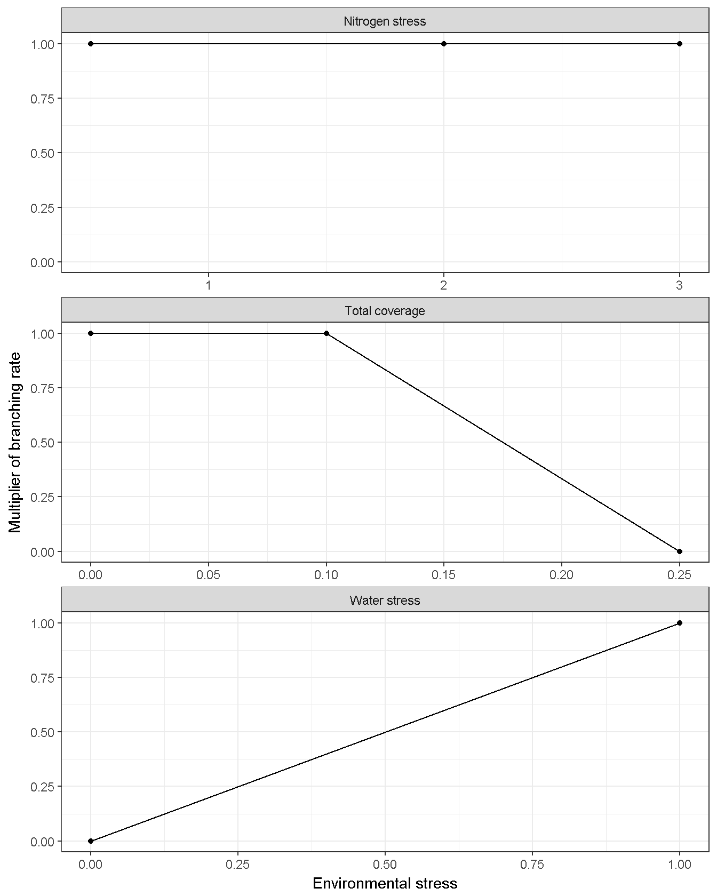

(\#fig:str-branching-factor)The factors to influence of branching rate (nitrogen stress, total coverage and water stress). The final multiplier of branching rate is the minimum values of the 

The values for total coverage are 0.1 and 0.25 in the wheat validation model. I would expect much higher coverage to stop tillering.

The step functions or leaf cohort model in the tillering processing cause that the tiller dynamic is too sensitive to the stage of terminal spikelet.

Figure \@ref(fig:tiller-number) shows the branching rate and total branching number in the test simulation without nitrogen stress on branching rate during branching period (from Emergence to Terminal Spikelet, Figure \@ref(fig:nitrogen-fn)).

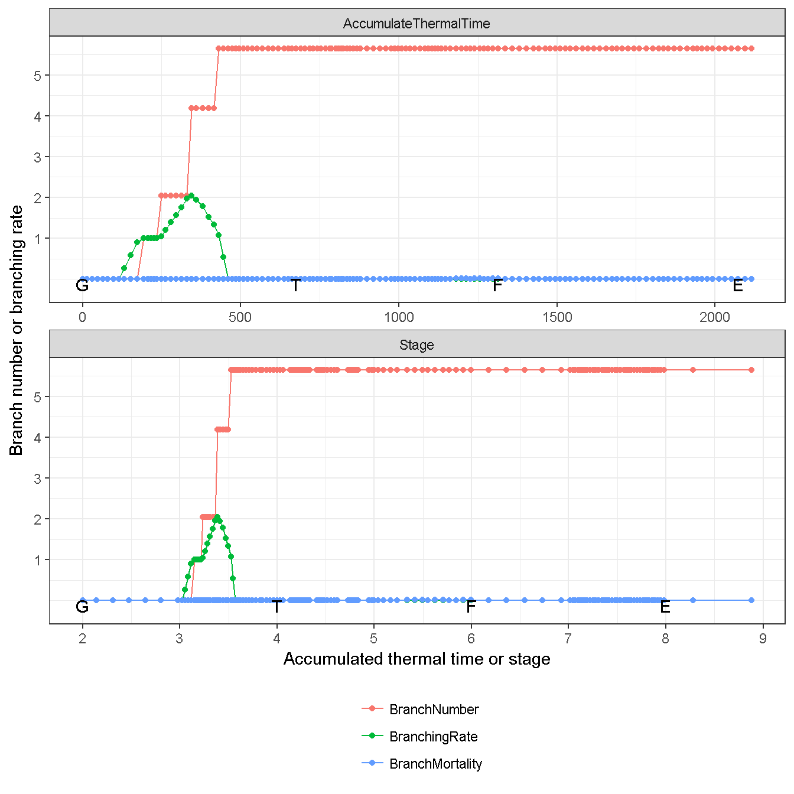

(\#fig:tiller-number)The branching rate and branch number for wheat

It seems PMF uses the branching rate one day before to calculate the branch number.

### Mortality {#sec-structure-mortality}

Two types of mortality are considered in the apex model, i.e. smaller tiller at terminal spikelet and low growth rate. For any types of tiller mortality, the plant does not reduce the population of existing leaf cohort, but number of apex, then reduce the population size of new leaf cohort. 

At the terminal spikelet, all tillers with less than 4 leaves are stopped to growth new leaves.

Branching mortality starts from the Flag leaf until Flowering which defines as a function of moving mean tiller growth rate (Figure \@ref(fig:mortality-growth-rate). The mean tiller growth rate is calculated as the 5 days moving means of tiller growth rate, which is calculated by the daily biomass supply divides thermal time and total stem population.  Reference required.

Need to check the mortality caused by growth rate.

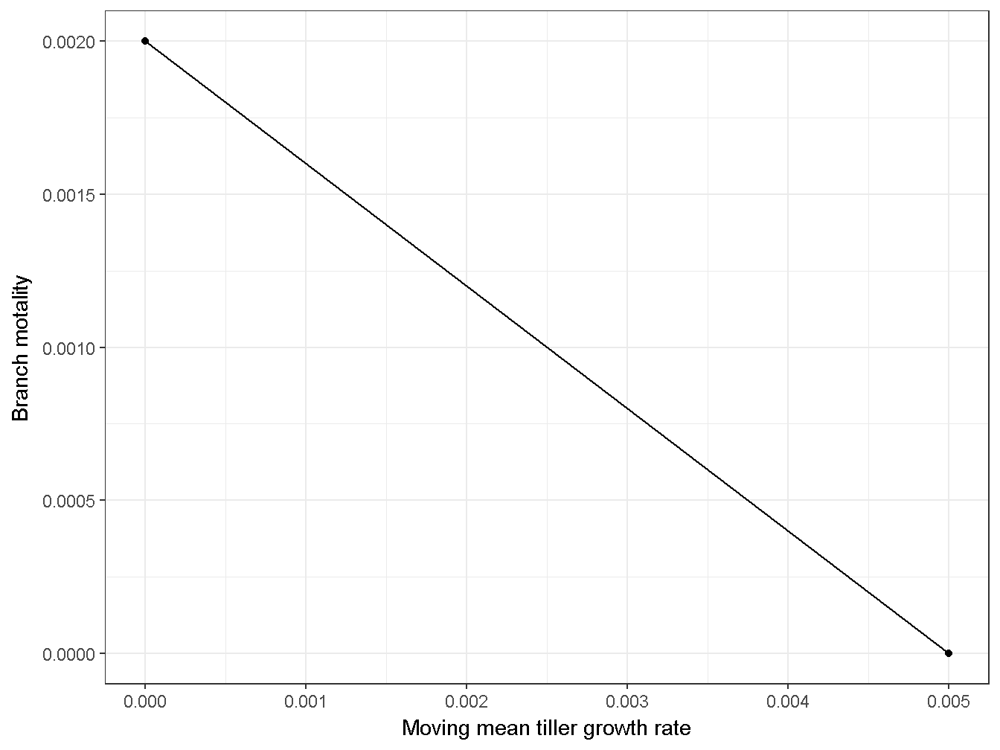

(\#fig:mortality-growth-rate)Tiller mortality as a function of moving mean tiller growth rate

Not sure why the tiller mortality starts from Flag leaf, not terminal spikelet, even the whole growth season

Figure \@ref(fig:tiller-growth-rate-factor) and \@ref(fig:tiller-growth-rate) show the mean tiller growth rate and the three factors to calculate it in the test simulation.

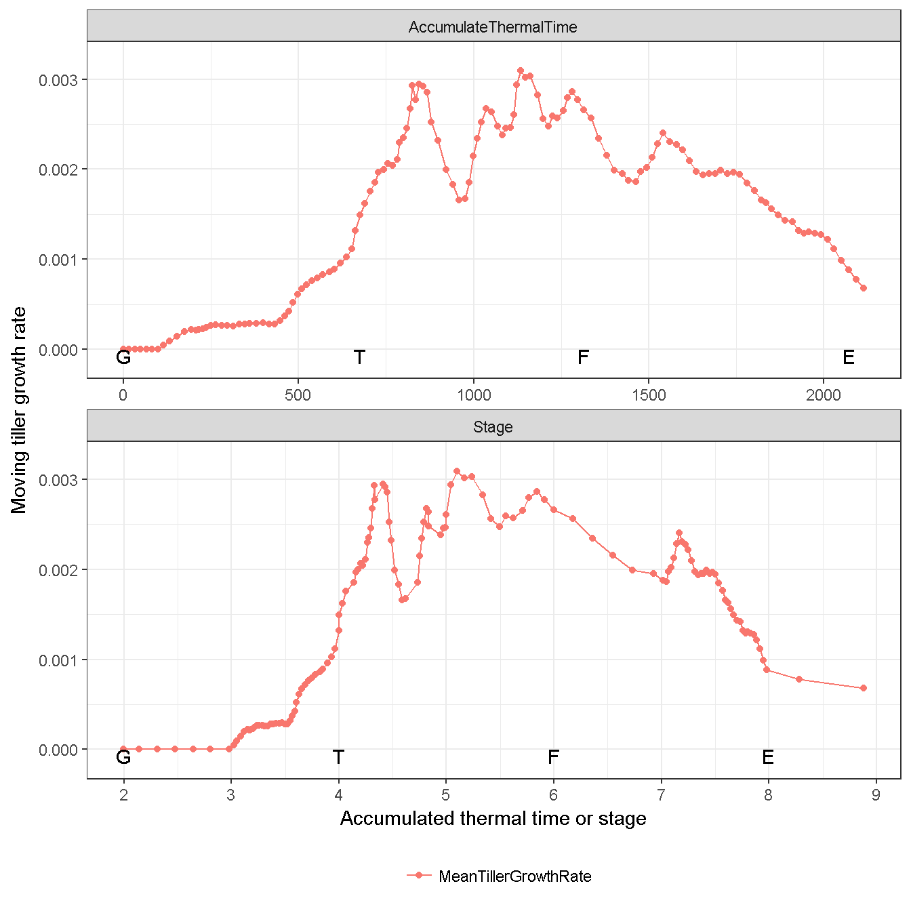

(\#fig:tiller-growth-rate)The moving tiller growth rate

As the primary bud number is equal to 1, the plant total node number and total primary node number are the same (Figure \@ref(fig:plant-node-number)). Figure \@ref(fig:plant-node-number) show the total node number as the results of tiller appearing and mortality.

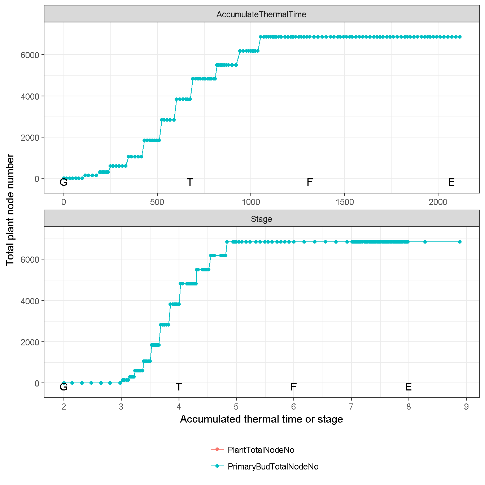

(\#fig:plant-node-number)Total plant node number

## Plant and Main-Stem Population

Plant population ($P$) is initialized at sowing from Sow event, and daily reduced by the plant mortality ($\Delta P$).
$$
    P=P_{0} - \sum_{t=T_{0}}^{T}(\Delta P)
$$

where, $P_{0}$ is the sown population, which initialized at sowing.

Population of main stem ($P_{ms}$) is calculated according to plant population ($P$) and primary bud number ($N_{bud}$) with default value 1 for wheat. The unit of $P_{ms}$ is per square meter.
$$
    P_{ms}=P \times N_{bud}
$$

Total stem population ($P_{stem}$) is summed up population of main stem ($P_{ms}$) and branches (($P_{branch}$)).
$$
    P_{stem} = P_{ms} + P_{branch}
$$

In the test simulation, the plant density ($P$) is 150 plants m^2^, so population of main stem ($P_{ms}$) equals to plant density (Figure \@ref(fig:plant-population)). From Emergence to terminal spikelet, the population of total stem ($P_{stem}$) multiply by stem number and plant density (Figure \@ref(fig:tiller-number)). 

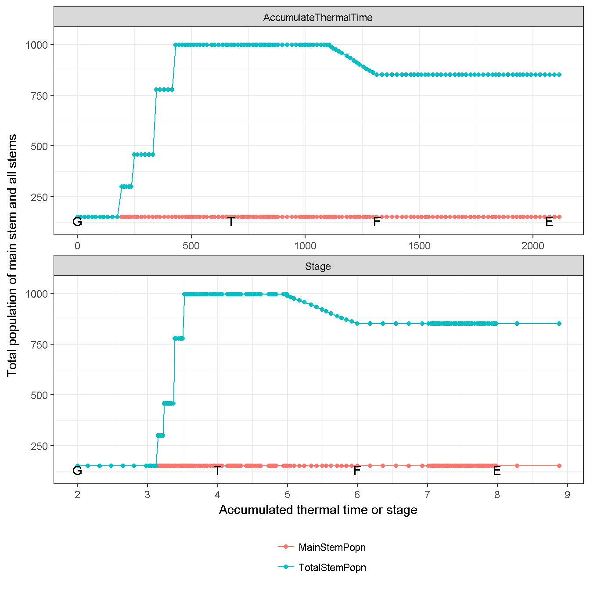

(\#fig:str-plant-population)The total population of main stem and all stems

## Canopy height
The canopy height is calculated as the potential height and adjusted by water stress. 

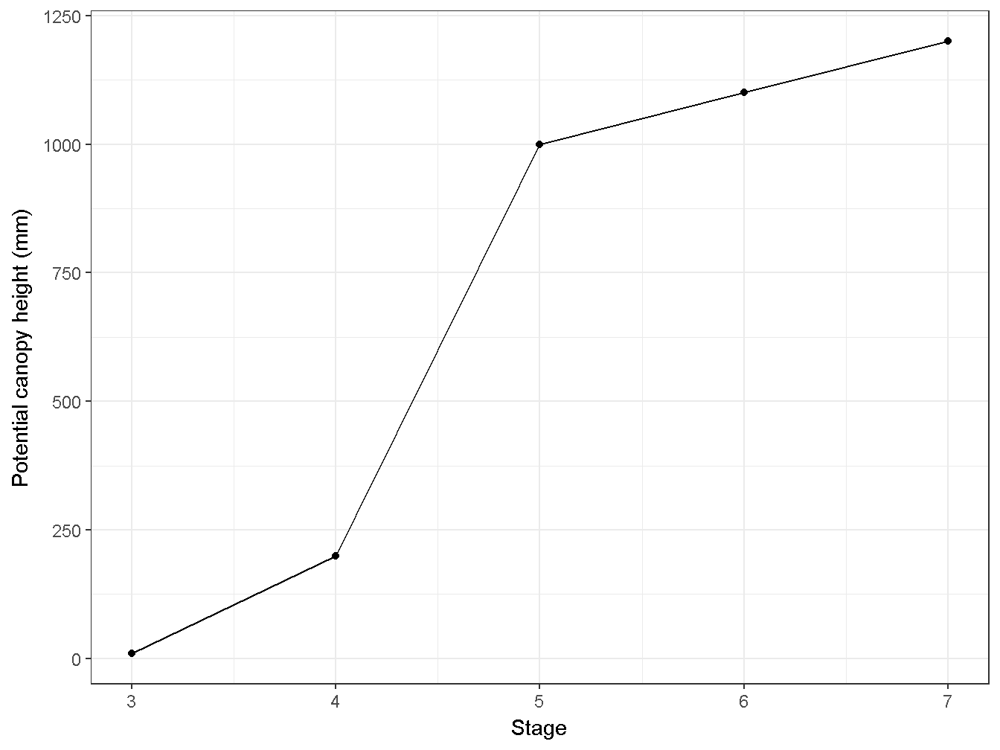

(\#fig:str-potential-height)Potential canopy height

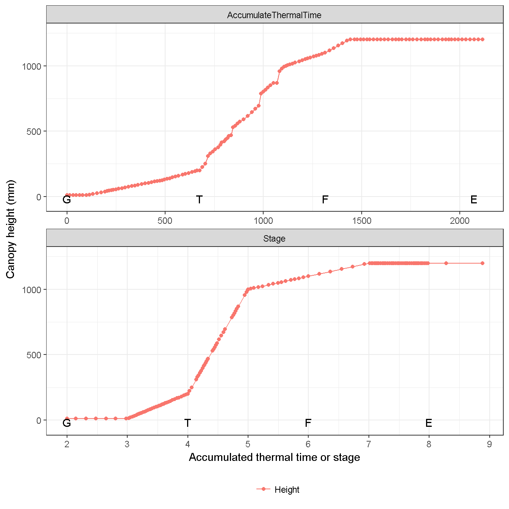

(\#fig:str-height)The simulated canopy height

-->

