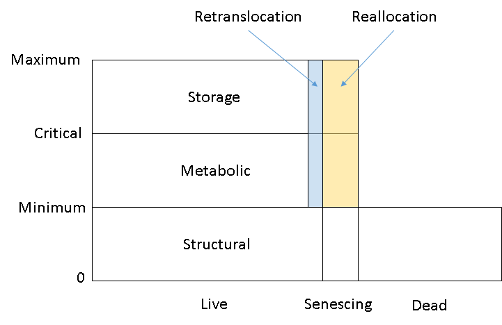

# Nitrogen {#cha:nitrogen}


```{r nitrogen-setup, message=FALSE, warning=FALSE, echo=FALSE}
source('_script/setup.R')
```

<div class="fig-input">
```{r nitrogen-diagram-dynamic, fig.cap="A diagram to represent the relationship between three nitrogen components (structural, metabolic and storage), three cadinal parameters of nitrogen concentrations (minimum, critical and maximum), three biomass pools (live, senescing and dead), and two nitrogen supply sources (retranslocation and rellocation)."}

```
</div>

<div class="fig-output">
```{r nitrogen-demand-supply, fig.cap='The plant total nitrogen demand and supply'}
y_cols <- c('Wheat.Arbitrator.N.TotalPlantSupply',
            'Wheat.Arbitrator.N.TotalPlantDemand')

g_report %>% 
    # filter(Wheat.Phenology.Stage <= 8) %>% 
    plot_report(g_xvar, y_cols, ncol = 2,
                x_lab = g_xlab, 
                y_labels = c('Supply', 'Demand'),
                y_lab = expression(atop('Nitrogen supply and demand', 
                                        '(g N'~m^-2~' ground'~d^-1~')')))

```
</div>


<div class="fig-output">
```{r nitrogen-fn, fig.cap='The fraction of nitrogen supply relative to nitrogen demand'}
y_cols <- c('Wheat.Arbitrator.FN')

g_report %>% 
    filter(Wheat.Phenology.Stage <= 8) %>% 
    plot_report(g_xvar, y_cols,
                x_lab = g_xlab, 
                y_lab = 'Ratio of nitrogen supply and demand ([-])')

```
</div>


<div class="fig-input">
```{r root-nitrogen-cadinalnitrogen, fig.asp=2, fig.cap='The parameter values of nitrogen concentrations in all organs including minimum, critical and maximum concentrations. Grain misses the critical nitrogen concentration. Root has the same minimum, critical and maximum concentration. Spike and stem have the same minimum and critical concentration.'}
y_labels <- list(Organ = g_organs,
     Para = c('MinimumNConc', "MaximumNConc", "CriticalNConc")) %>% 
    expand.grid(stringsAsFactors = FALSE)

y_cols <- y_labels %>% 
    apply(1, function(x) paste0('Wheat.', x["Organ"], '.', x["Para"]))
y_labels <- y_labels %>% 
    mutate(Trait = y_cols,
           Label = y_cols,
           Organ = factor(Organ, levels = g_organs),
           Para = gsub('NConc', '', Para),
           Para = factor(Para, 
                         levels = c('Minimum', 'Critical', "Maximum")))

g_report %>% 
    plot_report(g_xvar2, y_cols, ncol = 6,
                x_lab = g_xlab2,
                y_labels = y_labels,
                panel = 'Organ', color = 'Para',
                y_lab = expression(atop('Nitrogen concentration', 
                                        '(g N'~g^-1~' biomass)')))
```
</div>


## Supply {#sec:nitrogen-supply}


<div class="fig-output">
```{r nitrogen-supply-organ, fig.cap='The plant nitrogen supply for all organs'}

y_cols <- sprintf('Wheat.%s.NSupply.Total', g_organs)
g_report %>% 
    plot_report(g_xvar, y_cols, ncol = 5,
                y_labels = g_organs,
                x_lab = g_xlab, 
                y_lab = expression(atop('Nitrogen supply', 
                                        '(g N'~m^-2~' ground'~d^-1~')')))
```
</div>


<div class="fig-output">
```{r nitrogen-supply-component, fig.cap='The plant nitrogen supply for all components'}
y_cols <- c('Wheat.NSupply.Fixation', 'Wheat.NSupply.Reallocation',
            'Wheat.NSupply.Retranslocation', 'Wheat.NSupply.Uptake')
g_report %>% 
    plot_report(g_xvar, y_cols, ncol = 5,
                x_lab = g_xlab,
                y_lab = expression(atop('Nitrogen supply', 
                                        '(g N'~m^-2~' ground'~d^-1~')')))

```
</div>


## Demand {#sec:nitrogen-demand}


<div class="fig-output">
```{r nitrogen-demand-organ, fig.cap='The plant nitrogen demand for all organs'}
y_cols <- sprintf('Wheat.%s.NDemand.Total', g_organs)

g_report %>% 
    plot_report(g_xvar, y_cols, ncol = 5,
                y_labels = g_organs,
                x_lab = g_xlab, 
                y_lab = expression(atop('Nitrogen demand', 
                                        '(g N'~m^-2~' ground'~d^-1~')')))
```
</div>


<div class="fig-output">
```{r nitrogen-demand-component, fig.cap='The plant nitrogen demand for all components'}
y_cols <- c('Wheat.NDemand.Structural', 'Wheat.NDemand.Metabolic',
            'Wheat.NDemand.Storage')

g_report %>% 
    plot_report(g_xvar, y_cols, ncol = 5,
                x_lab = g_xlab, 
                y_lab = expression(atop('Nitrogen demand', 
                                        '(g N'~m^-2~' ground'~d^-1~')')))

```
</div>


## Nitrogen uptake {#ses:nitrogen-uptake}
<!--
Potential N uptake by the root system is calculated for each soil layer that the roots have extended into. In each layer potential uptake is calculated as the product of the mineral nitrogen in the layer, a factor controlling the rate of extraction (kNO3 or kNH4), the concentration of N form (ppm), and a soil moisture factor (NUptakeSWFactor) which typically decreases as the soil dries.  
_NO3 uptake = NO3<sub>i</sub> x KNO3 x NO3<sub>ppm, i</sub> x NUptakeSWFactor_
_NH4 uptake = NH4<sub>i</sub> x KNH4 x NH4<sub>ppm, i</sub> x NUptakeSWFactor_

Nitrogen uptake demand is limited to the maximum daily potential uptake (MaxDailyNUptake) and the plants N demand. 
    /// The demand for soil N is then passed to the soil arbitrator which determines how much of the N uptake demand
    /// each plant instance will be allowed to take up.
    ///
-->
<div class="fig-output">
```{r root-nitrogen-uptake, fig.cap='The plant nitrogen uptake'}


y_cols <- c('Wheat.Root.NUptake', 'Wheat.Root.NSupply.Uptake',
            'Wheat.Root.NSupplyUptake', 'Wheat.Arbitrator.N.TotalUptakeSupply')
g_report %>% 
    mutate(Wheat.Root.NUptake = Wheat.Root.NUptake * -0.1) %>% 
    plot_report(g_xvar2, y_cols, ncol = 5,
                x_lab = g_xlab2,
                y_lab = expression(atop('Nitrogen uptake', 
                                        '(g N'~m^-2~' ground'~d^-1~')')))
```
</div>

## Nitrogen dynamic {#sec:nitrogen-dynamic}


<div class="fig-output">
```{r root-nitrogen-dynamic, fig.cap='The plant nitrogen uptake'}

y_cols <- c(paste0('Wheat.', g_organs, '.N'), 'Wheat.Total.N')
g_report %>% 
    plot_report(g_xvar, y_cols, ncol = 6,
                x_lab = g_xlab,
                y_labels = c(g_organs, 'Total'),
                y_lab = expression(atop('Nitrogen contents', 
                                        '(g N'~m^-2~' ground)')))

```
</div>


<div class="fig-output">
```{r root-nitrogen-concentration, fig.cap='The plant nitrogen concentration'}

y_cols <- c(paste0('Wheat.', g_organs, '.Nconc'), 'Wheat.Total.NConc')
g_report %>% 
    plot_report(g_xvar, y_cols, ncol = 6,
                x_lab = g_xlab,
                y_labels = c(g_organs, 'Total'),
                y_lab = expression(atop('Nitrogen concentration', 
                                        '(g N'~m^-2~' ground)')))

y_cols <- c(paste0('Wheat.', 'Root', '.Nconc'))
g_report %>% 
    plot_report(g_xvar, y_cols, ncol = 6,
                x_lab = g_xlab,
                y_labels = c('Root'),
                y_lab = expression(atop('Nitrogen concentration', 
                                        '(g N'~m^-2~' ground)')))


```
</div>


